# SOFT2412 Project Report - Sprint 1

>[!INFO] GitHub Repository
>Access the project repository on GitHub: https://github.sydney.edu.au/SOFT2412-COMP9412-2024Sem2/Steph_Lab11_Group01_Assignment2

>[!IMPORTANT] Individual Contribution
>A detailed account of my contributions and self-evaluation is available in the appendix of this report.

>[!IMPORTANT] Meeting Records
>Information about all meetings, including recording links, can be found in the appendix of this report.

## 1. Overview

In the first sprint of developing the Virtual Scroll Access System (referred to as VSAS throughout this report), our focus is on implementing the basic functionality of the application. The key features developed include:

- **User Registration**: Allowing new users to create accounts.
- **User Login**: Enabling secure access for registered users.
- **View Scroll List**: Displaying a list of available scrolls.
- **Upload Scroll**: Providing users with the ability to upload scrolls.
- **Download Selected Scroll**: Allowing users to download chosen scrolls.

## 2. Scrum Events and Artefacts

Scrum events and artefacts are essential components of the Scrum framework, providing structure and transparency throughout the development process.

In this project, critical scrum events are performed, including:

- **Scrum Team Formation**: Defining roles and responsibilities within the team to ensure efficient collaboration.
- **Setting Up Scrum Project Board**: Organizing and visualizing tasks to track progress and manage workflows.
- **Meetings**:
    - **Sprint Planning Meetings**: Outlining sprint goals and defining the work for the upcoming sprint.
    - **Daily Scrum Meetings**: Conducting short stand-up meetings to align the team, identify obstacles, and plan daily tasks.
    - **Sprint Review Meetings**: Reviewing completed work with stakeholders to gather feedback and validate the sprint outcomes.
- **Writing User Stories and Sprint Backlogs**: Documenting requirements and breaking down tasks into manageable units.
- **Performing Acceptance Tests and Code Reviews**: Ensuring quality and compliance by verifying the application against acceptance criteria and conducting thorough code assessments.

### 2.1 Scrum Team Formation

In this project, to establish an effective Scrum team, the following roles and responsibilities are defined:

- **Product Owner**: The Product Owner is responsible for defining the features of the product and ensuring that the team delivers value to the stakeholders.
- **Scrum Master**: The Scrum Master facilitates the Scrum process and ensures that the team adheres to Agile principles.
- **Development Team**: This is a group of professionals with coding skills necessary to deliver the product increment.

With only five team members, each member is assigned a role, ensuring everyone contributes to the software development process. The Product Owner and Scrum Master also take part in the development team, playing dual roles to help with the development of the application while fulfilling their primary responsibilities.

| Name (Unikey)            | Scrum Role                      |
| ------------------------ | ------------------------------- |
| Yilin Li (yili2677)      | Product Owner, Development Team |
| Junrui Kang (jkan3790)   | Scrum Master, Development Team  |
| Xinchen Huang (xhua2497) | Development Team                |
| Huiying Jiao (hjia7380)  | Development Team                |
| Zhiyuan Na (zhna4143)    | Development Team                |

>[!IMPORTANT]
>The team formation and role assignment is done in the Sprint 0 face-to-face meeting happened in the tutorial. This meeting can be found in the meeting record.

### 2.2 GitHub and Scrum Project Board

>[!NOTE]
>This part is completed by Junrui Kang (jkan3790)

>[!REFERENCE]
>The GitHub scrum project board is inspired by [this post](https://www.ssw.com.au/rules/scrum-in-github/).

In this scrum project, the scrum project board is constructed using GitHub project board and GitHub issues.

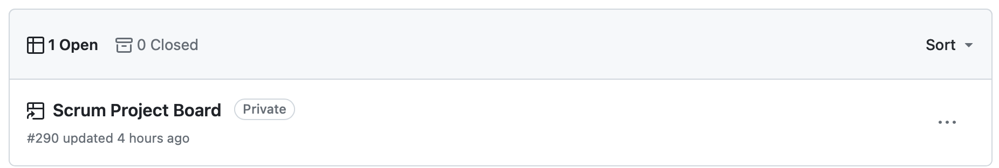

The GitHub project board acts as the central hub for managing backlogs, tracking progress, and visualising the overall workflow.

Tasks assigned to developers can be clearly seen in the `CurrentSprint` view of the project board. A task can have different status:

- **Backlog Ready**: This status indicates that the task has been identified and is ready to be pulled into an upcoming sprint. It has been prioritized and approved, but it has not yet started.
- **In Progress**: This status is for tasks that are currently being worked on by a developer. It shows that the task has been pulled from the backlog and is actively undergoing development.
- **In Review**: When a developer completes a task, it moves to this status. This indicates that the task is awaiting review, which could include code review, testing, or approval from another team member. It must pass these checks before merging to the development branch.
- **Done**: This status signifies that the task has been completed and has passed all necessary reviews and testing.

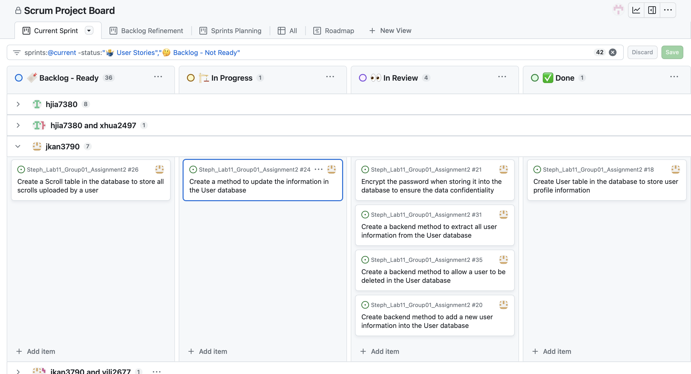

GitHub issues serve as the building blocks for user stories. An issue template called `user-story` is used to create consistency in how these stories are structured and documented.

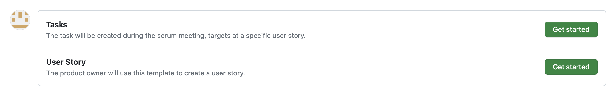

All user stories will be in the format of `As a (role), I want to (action), so I can (benefit).` This format ensures that each user story is user-centric and highlights the value the feature or task will bring to the end user.

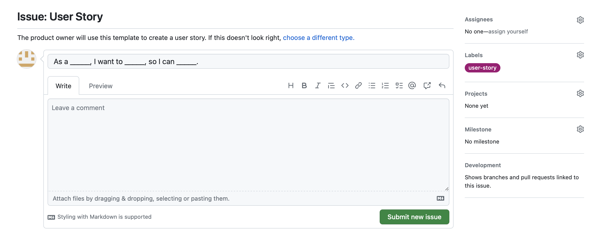

For each new user story created by the project owner, It will be marked as `User Story` in the project board. Then specific backlog can be written as goals to satisfy each user story. These backlogs can be created using the `task` template using the GitHub issue.
 
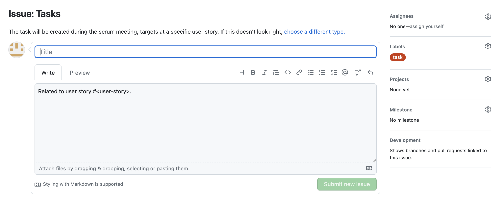

These created tasks are marked as `Backlog Not Ready` These tasks are not yet ready to be worked on, as further clarification or information is needed before they can be moved forward.

Once the requirements are specified and a developer is assigned, the task is marked as `Backlog Ready`. It indicates that the task is now fully prepared to be pulled into an upcoming sprint for development for the assigned developer.

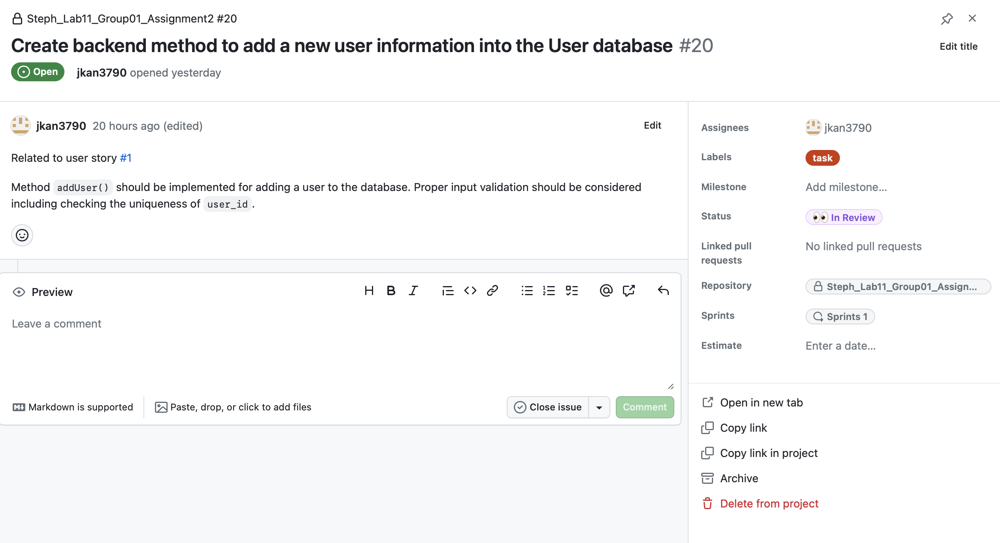

In the `Sprints Planning` tab, tasks are allocated and organised for upcoming sprints based on their priority. In the first sprint, several tasks are been allocated to the second sprint as these tasks are the enhancement of current features.

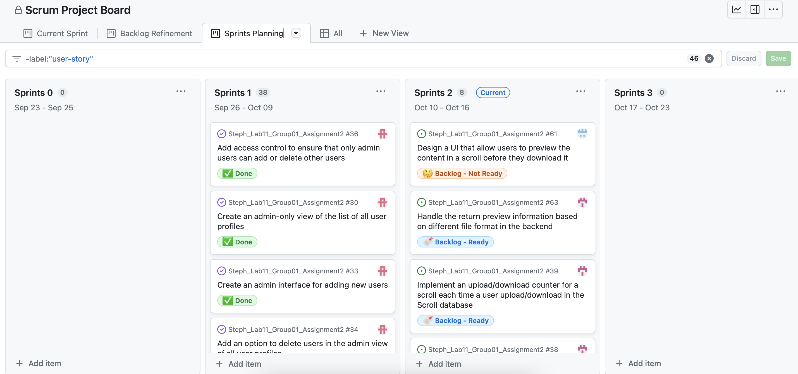

### 2.3 Meetings

#### 2.3.1 Sprint Planning Meetings

The Sprint planning meeting is to define what can be delivered in the sprint and how that work will be achieved. In this sprint, the sprint planning meeting happened in the first meeting, where we set the sprint goal and work assignment to developers.

>[!IMPORTANT]
>This meeting can be found in the meeting record in the appendix.

The main goal for Sprint 1 is to develop the basic functionalities of the application, including:

- Login and register as a user to use the application.
- View, upload and download scrolls.
- Perform user profile modification.
- Perform basic admin actions including adding and deleting users.

Other enhancement features such as preview scrolls, scroll statistics (e.g. download counters) and search functionalities. These features will be developed in the next Sprint (Sprint 2).

#### 2.3.2 Daily Scrum Meetings

All team members have agreed to hold three formal online meetings each week, taking place on Zoom at the following times:

- Every Monday night 8:30pm
- Every Tuesday night 8:30pm
- Every Sunday night 8:30pm

>[!IMPORTANT]
>These meetings can be found in the meeting record in the appendix.

These meetings are recorded to ensure that all discussions are documented and accessible for future reference. The primary objective is to demonstrate individual progress. During these sessions, each member provides updates on their tasks, discusses challenges faced, and outlines their plans for further developments. The recorded meetings also serve as a valuable resource for team reflection during sprint reviews.

#### 2.3.3 Spring Review Meetings

The Sprint review meeting happens at the end of each sprint (Thursday in the tutorial) and serves as an opportunity for the team to demonstrate the work completed during the sprint to the Product Owner, stakeholders, and other team members. During this meeting, the team presents the increment and demonstrates its functionality.

In our recent Sprint Review Meeting, the tutor, acting as our stakeholder, provided several key pieces of feedback, including:

- **File Uploads**: The system should allow `.txt` files to be uploaded, expanding the range of supported file types for users.
- **Email and Phone Number Validation**: It is important to validate email addresses and phone numbers before updating them in the user profile, ensuring the integrity and accuracy of user data within the system.
- **Preview Functionality for Scrolls**: The preview feature should be implemented specifically for `.txt` files, as previewing other file types (e.g. `.png`) in a terminal-based application is not practical. This feature would enhance the user experience by allowing quick content checks for text files.
- **Scroll of the Day**: A new feature was requested that enables users to view random scrolls. The system should display a different random scroll each day, ensuring that users have varied content to explore with each session.

This feedback helps refine the development process, guiding the team’s focus on enhancing features and addressing user needs. These features will be implemented in the next sprint (Sprint 2).

### 2.4 User Stories, Backlogs and Review

>[!NOTE]
>This part is completed by Yilin Li (yili2677) and Junrui Kang (jkan3790)

In sprint 1, the team successfully implemented a series of user stories designed to enhance user engagement and functionality within the Virtual Scroll Access System (VSAS).

These stories encompass a range of features for both regular users and administrators, addressing account management, user access control, scroll creation, modification, and retrieval.

By focusing on user experience and security, the development efforts lay a solid foundation for the application, ensuring that it meets the diverse needs of its user base.

#### 2.4.1 User Related

>[!QUESTION] User Story
>As a user, I want to create an account, so I can save my detailed profiles in the system.

>[!TODO] Sprint Backlog
> To achieve user story, these backlogs are created and assigned to developers:
> - Create User table in the database to store user profile information.
> - Design user registration form in the application main interface.
> - Create backend method to add a new user information into the User database.
> - Encrypt the password when storing it into the database to ensure the data confidentiality.
> - Implement access control to distinguish between guest users and registered users.

>[!CHECK] Acceptance Test and Review
>All user data is stored in the `User` table in a SQLite database. The primary key constraint of `user_id` ensures that users will have a unique identifier in this application.
>
>Users can select `2` when launching the application to register a new account.
>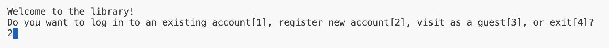
>
>Users can enter their phone number, email, username, password etc. during registration. They can always quit the registration process by typing `Q` to return to the previous page.
>
>
>The password has been properly hashed and salted with `bcrypt` module. In the database, the password field of a user is stored in hash.
>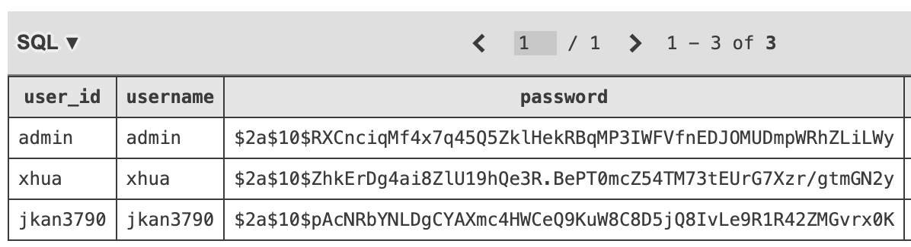
>
>User can also select `1` to login to the application by providing the matching username and password. Once the user enters the main application, their username will be displayed on the top of the application interface.
>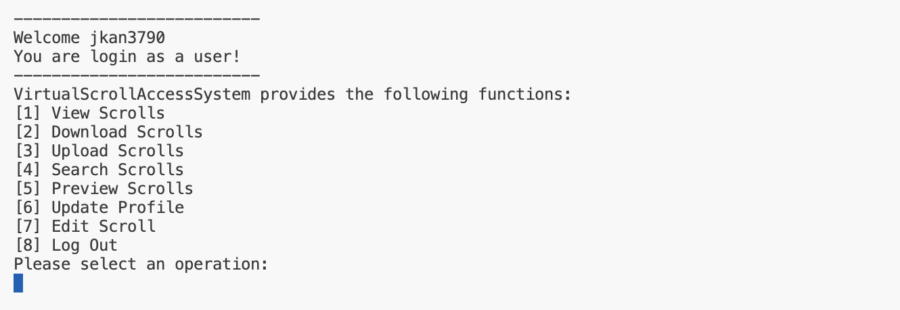
>
>If the user wish to use the application as a guest user, they can select `3`. As guests, they only have limited access to the application compared to registered users.
>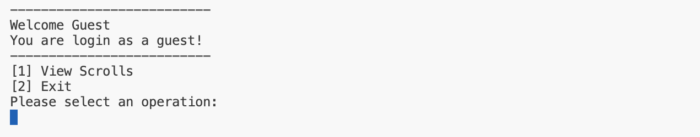

>[!QUESTION] User Story
>As a user, I want to update my details, so I can login and renew my profile and password.

>[!TODO] Sprint Backlog
> To achieve user story, these backlogs are created and assigned to developers:
> - Design a user profile update form to allow user to edit their profile.
> - Add a change password section within the profile update form.
> - Create a method to update the information in the User database.
> - Implement secure password reset options for safety.

>[!CHECK] Acceptance Test and Review
>Once the user logs into the application, they can select the option `6` from the main menu to update their profile. The application will display the update profile interface where the user can make modifications.
>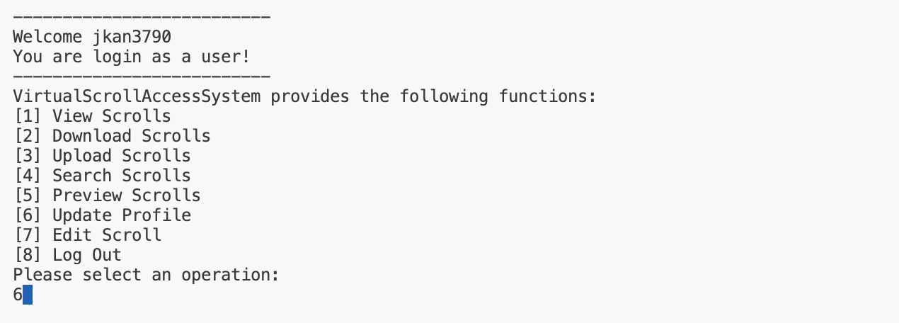
>
>All detailed user profile information is displayed at the top of the page. This includes existing information such as email, phone number and username. The user is able to see their profile details clearly and navigate to edit any of the available fields.
>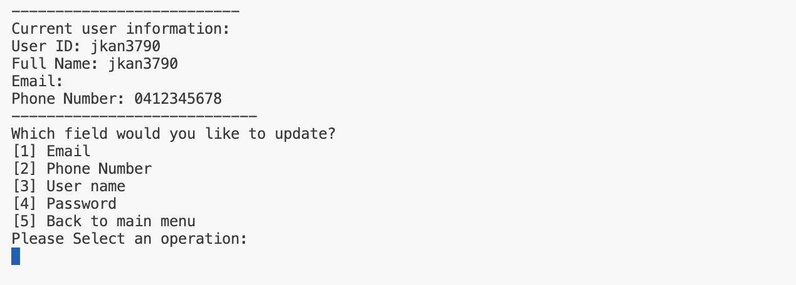
>
>If the user selects a field to update (e.g. email), they are prompted to enter the new information. The application will correctly prompt the user for new information and validate the input before proceeding.
>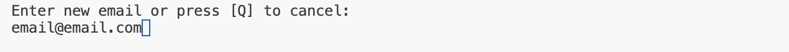
>
>The updated profile information is displayed, confirming the successful change.
>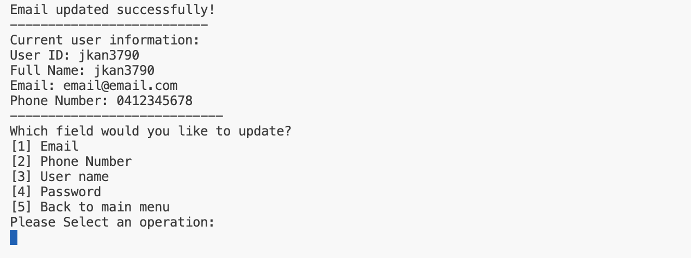
>
>If the user chooses to update their password, an additional security measure is taken. The user is first prompted to enter their current password to verify their identity. If the correct password is provided, the user is then allowed to set a new password. If the password does not match, the update is denied.
>
>
>This acceptance test ensures that the profile update functionality is secure and user-friendly while maintaining data security through password verification.

>[!QUESTION] User Story
>As a guest user, I want to view scrolls, so I can be anonymously using the application without login.

>[!TODO] Sprint Backlog
> To achieve user story, these backlogs are created and assigned to developers:
> - Design a public-facing view to display all available scrolls.
> - Implement a backend method to extract all scrolls stored in the database.

>[!CHECK] Acceptance Test and Review
>When a guest user accesses the application, they will be directed to a public-facing panel where all available scrolls are displayed. No other functionality is available to guest users.
>
>
>When a guest user views the scrolls, the following details will be visible for each scroll: name of the scroll, ID of the scroll, upload time and uploader's ID.
>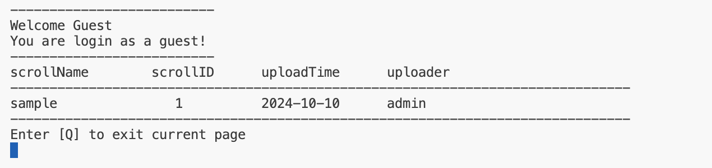
>
>Guest users are able to see all available scrolls and their relevant details clearly, without needing to log in. Only viewing access is provided; no editing or additional interactions are allowed

#### 2.4.2 Admin Related

>[!QUESTION] User Story
>As an admin, I want to view a list of user profiles, so I can view all user details.

>[!TODO] Sprint Backlog
> To achieve user story, these backlogs are created and assigned to developers:
> - Create an admin-only view of the list of all user profiles.
> - Create a backend method to extract all user information from the User database.
> - Implement access control and authentication of admin users.

>[!CHECK] Acceptance Test and Review
>When a user logs into the application with admin credentials, they are directed to the admin panel. Normal users cannot access this page as they do not have the necessary admin permissions.
>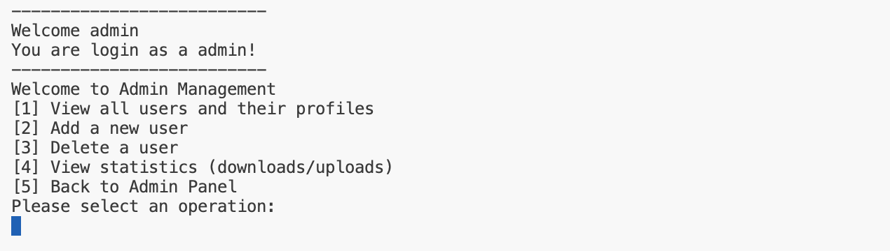
>
>The admin is presented with a list of all registered users and their relevant details, confirming their ability to monitor and manage user information within the application. Admin can select `1` to view all registered users' profile. Users' id, username, role, phone number and email will be displayed.
>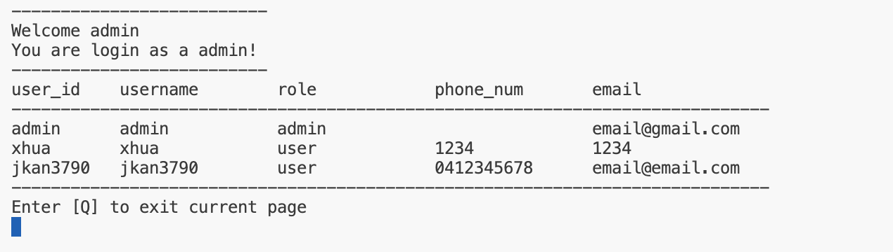
>
>Regular users are restricted from accessing this information to maintain privacy and security.

>[!QUESTION] User Story
>As an admin, I want to add and delete other users, so I can manage the user access.

>[!TODO] Sprint Backlog
> To achieve user story, these backlogs are created and assigned to developers:
> - Create an admin interface for adding new users.
> - Add an option to delete users in the admin view of all user profiles.
> - Create a backend method to allow a user to be deleted in the User database.

>[!CHECK] Acceptance Test and Review
>In the admin panel, admin user can select `2` to add a new user into the system.
>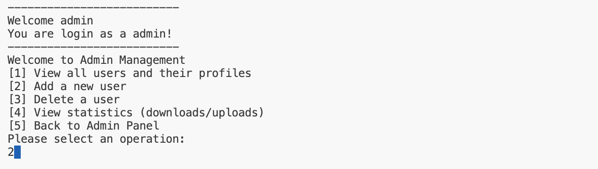
>
>The admin is prompted to enter all critical information for the new user, including their username, role, phone number, and email. An admin account can also be created through this method. However, the standard registration process does not allow the creation of an admin account.
>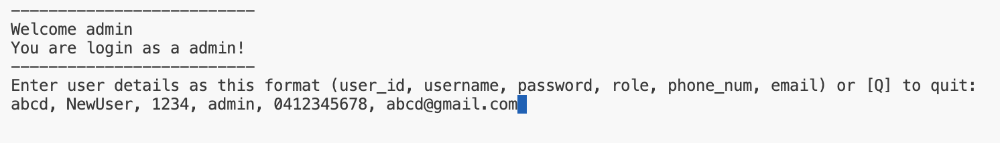
>
>Once the information is submitted, the new user, including admin users if specified, will be added successfully and appear in the full user list.
>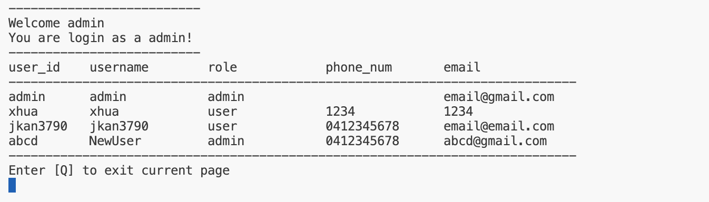
>
>In the admin panel, admin can also choose to delete a user by selecting `3`.
>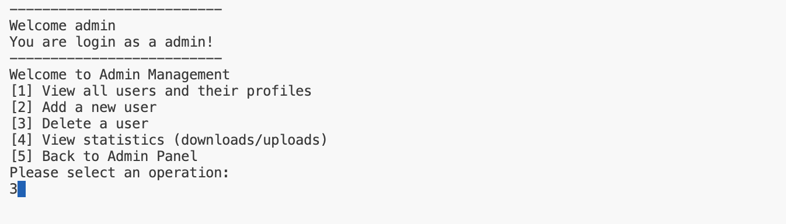
>
>The application displays a list of all users, and the admin is prompted to enter the ID of the user they wish to delete.
>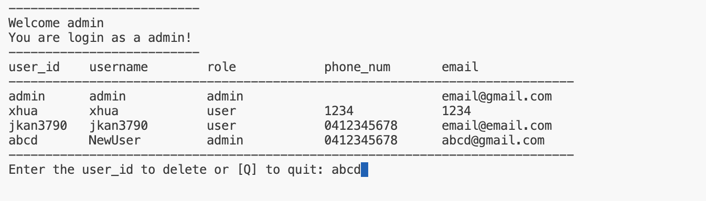
>
>After entering the user ID and confirming the deletion, the selected user will be removed from the system. The user will no longer appear in the list of all users.
>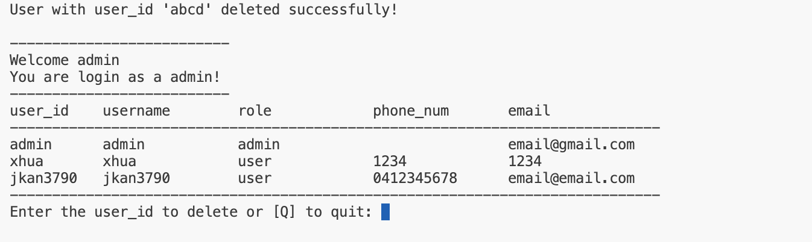
>
>Only users with admin roles have permission to add or delete users, ensuring that these actions are restricted and secure.

#### 2.4.3 Scroll Related

>[!QUESTION] User Story
>As a user, I want to view all available scrolls stored in the system, so I can decide which scroll to download.

>[!TODO] Sprint Backlog
> To achieve user story, these backlogs are created and assigned to developers:
> - Design a public-facing view to display all available scrolls.
> - Implement a backend method to extract all scrolls stored in the database.

>[!CHECK] Acceptance Test and Review
>When a user views the scrolls, the following details will be visible for each scroll: name of the scroll, ID of the scroll, upload time and uploader's ID. This is the same as the guest user functionality.
>

>[!QUESTION] User Story
>As a user, I want to add new digital scrolls, so I can upload it in binary file format.

>[!TODO] Sprint Backlog
> To achieve user story, these backlogs are created and assigned to developers:
> - Create a Scroll table in the database to store all scrolls uploaded by a user.
> - Ensure the binary file can be stored in the Scroll database in BLOB object.
> - Create a UI for users to upload new digital scrolls.
> - Create a backend method to add a new scroll into the Scroll database.
> - Implement access controls for uploaded scrolls, ensuring only registered users can upload and download scrolls.

>[!CHECK] Acceptance Test and Review
>All scrolls are stored in the database as binary files (`BLOB` format). Additional information such as scroll name, uploader, and upload time is also recorded in the SQLite database for tracking purposes.
>
>Registered users select option `3` from the main menu to access the scroll upload feature.
>
>
>The uploader is prompted to enter the name of the scroll and the file path of the scroll.
>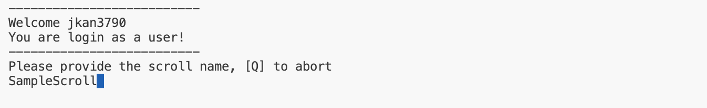
>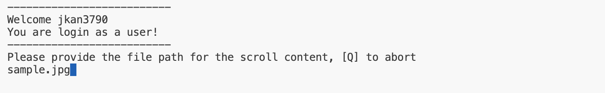
>
>After the upload is confirmed, the new scroll entry is added to the database. The user receives a success message, and the scroll is visible in the system’s scroll list. The scroll is stored successfully, and all related metadata (name, uploader, upload time) is visible when viewing the scroll list.
>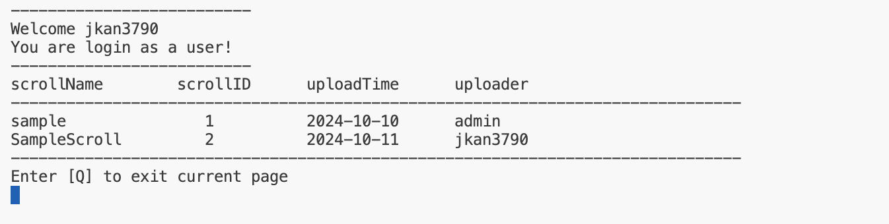
>
>The application confirms that only registered users can upload scrolls and download them later. If an invalid file or path is provided, the system will refuse the uploading request.

>[!QUESTION] User Story
>As a user, I want to edit and update scrolls, so I can make modifications to my uploaded scrolls.

>[!TODO] Sprint Backlog
> To achieve user story, these backlogs are created and assigned to developers:
> - Create an edit scroll UI for users to view and modify their uploaded scrolls.
> - Create a backend method to update the scroll content.
> - Keep access controls in place to ensure only authorised users (scroll owner or admin) can edit the scroll.

>[!CHECK] Acceptance Test and Review
>Users can select option `7` from the main panel to access the scroll management options (edit or delete).
>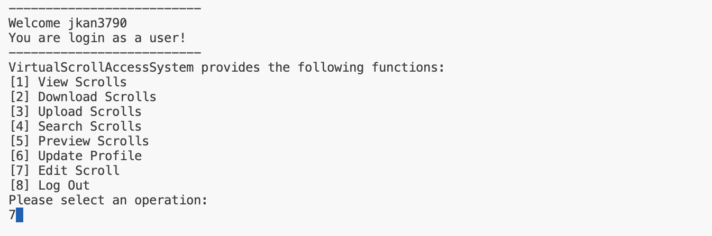
>
>
>If the user wish to edit the scroll, the application will firstly display all scrolls available in the database. The user can select a scroll based on its ID to proceed with editing.
>
>A normal user can only edit the scroll that is uploaded by himself. If a normal user tries to access a scroll that they do not own, the system denies the request and displays an error message. Access is granted only to the scroll owner or the admin, ensuring data security and proper user permissions.
>
>
>If the user has permission, they can edit the scroll content. If the scroll is a `.txt` file, the user is allowed to modify its content directly within the application. For other file types, the user can replace the existing file by uploading a new one. The edited content or the new file will be saved in the database, updating the scroll entry accordingly.
>
>The system ensures that only authorised users (the scroll owner or admin) can edit scrolls, preventing unauthorised access and maintaining the integrity of user data.

>[!QUESTION] User Story
>As a user, I want to remove my uploaded scrolls, so I can login my account and do these operations.

>[!TODO] Sprint Backlog
> To achieve user story, these backlogs are created and assigned to developers:
> - Create a UI on the user's profile page to display a list of uploaded scrolls for the specific user.
> - Implement a delete option next to each scroll for user to remove their uploaded scrolls.
> - Create a backend method to delete the scroll in the Scroll database.
> - Create a backend method to extract all scrolls uploaded by a user given their user_id.
> - Verify that users can only delete their own scrolls unless they have admin privileges.

>[!CHECK] Acceptance Test and Review
>Users can access the delete scroll feature through the profile page interface. They select `2` in the edit panel to manage their uploaded scrolls.
>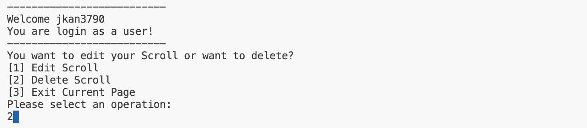
>
>The application displays a list of scrolls that the user has uploaded, with a delete option next to each scroll. Users are prompted to confirm the deletion of the selected scroll.
>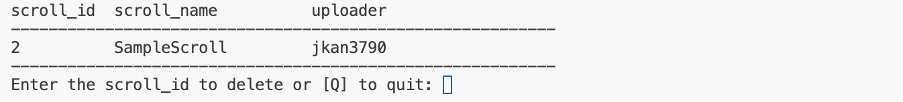
>
>When a user attempts to delete a scroll, the system checks if the user owns the scroll or has admin privileges. Unauthorised deletion attempts are blocked.
>
>If the user confirms and has the necessary permissions, the scroll is removed from the database. The application updates the scroll list to reflect the change. The selected scroll is no longer visible in the list.
>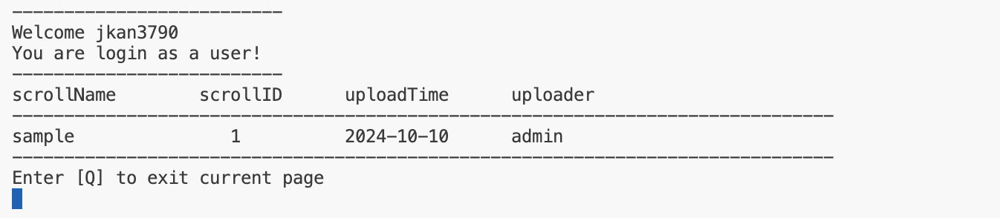
>
>The system ensures that only authorised users (scroll owner or admin) can delete scrolls, maintaining data availability.

>[!QUESTION] User Story
>As a user, I want to download scrolls, so I can read the content in the scroll.

>[!TODO] Sprint Backlog
> To achieve user story, these backlogs are created and assigned to developers:
> - Design a UI for user to download an available scroll from a list of scrolls.
> - Create a backend method to extract the scroll content given the scroll_id from the Scroll database.

>[!CHECK] Acceptance Test and Review
>Users can initiate the download process by selecting option `2` from the main menu.
>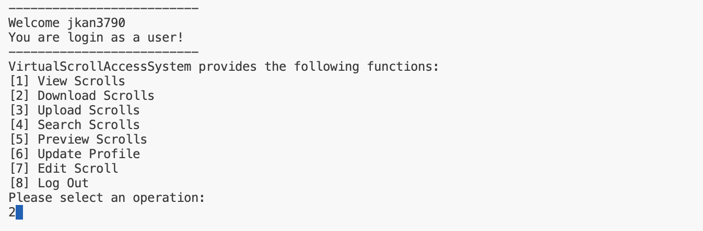
>
>The system retrieves and displays a list of all available scrolls in the database. Users are prompted to enter the ID of the scroll they wish to download.
>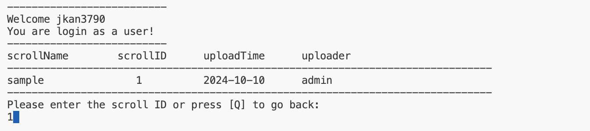
>
>After entering the desired scroll ID, the user is prompted to provide a valid directory path where the scroll will be downloaded. The directory path must be valid and accessible. The application will validate the input, and notify the user that the path is invalid.
>
>Upon receiving a valid directory path, the application retrieves the scroll content from the database and saves it to the specified location. The scroll will be saved with its original name as the file name. The scroll is successfully downloaded to the user’s specified directory.

## 3. Agile Tools

Agile tools are essential for streamlining and automating various aspects of the development process, ensuring efficiency, collaboration, and quality. In this project, we utilise agile tools to manage code, automate builds, and run tests, supporting continuous integration and delivery (CI/CD).

### 3.1 Code Management: GitHub

In this project, we use GitHub as our primary tool for code management. The GitHub repository serves to store the code and maintain the revision history of each file, allowing anyone with the necessary permissions to make modifications and fixes.

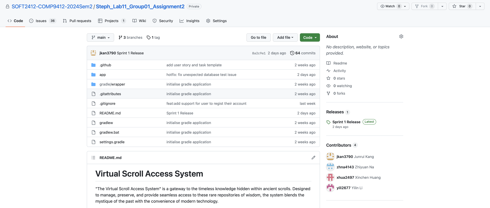

#### 3.1.1 Git Commands

Several key `git` commands are utilized for modifying, creating, and pulling actions within a GitHub repository. Here are the primary functions associated with each command used in this project:

- `git fetch`: Retrieves updates from the remote repository and integrates them into the local repository, allowing for a review of changes before applying them.
- `git push`: Sends local commits or branches to the remote repository, updating it with the latest changes.
- `git pull`: Updates the local branch to match the remote branch by fetching and integrating new changes.
- `git add`: Moves changes made in the working directory to the staging area, preparing them for a commit.
- `git commit`: Saves the staged changes to the local repository and creates a new entry in the commit history.
- `git checkout`: Allows users to switch between branches or access specific commits in the repository.
- `git merge`: Combines changes from one branch into another, integrating different lines of development.
- `git status`: Displays the current state of the repository, including information about uncommitted or untracked changes and the staging status of files.

#### 3.1.2 Branches and Branch Protection

Our repository utilises a structured branching model to maintain code stability and organisation:

1. The **`main` branch** holds the release versions of the project. Direct pushes are **not allowed**, and merges can only occur from `dev` after proper testing and review. Only fully tested code that is ready for release should be merged into `main`.
2. The **`dev` branch** is designated for active development. New features and tests must be conducted in dedicated branches created from `dev`. Feature branches are named `feature-[feature-name]`, while test branches are named `test-[testing-name]`. Code should be pushed to the respective branch and merged into `dev` only after thorough review and testing.
3. The **`report` branch** focuses on documenting the development process, challenges, solutions, and overall progress after a release. It is updated after merging a release into `main` and includes project reports.

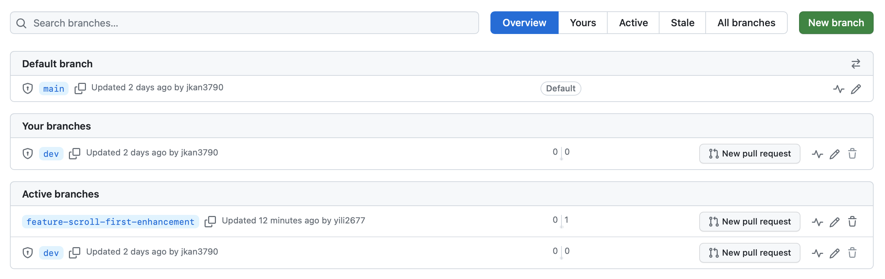

Branch protection rules are applied to `main` and `dev` branches:

- **Main**: Protected from direct pushes; all merges must be through a pull request. Merges from `dev` to `main` require approval from at least two members.
- **Dev**: Always branch from `dev` for new work, submitting pull requests for review prior to merging back.

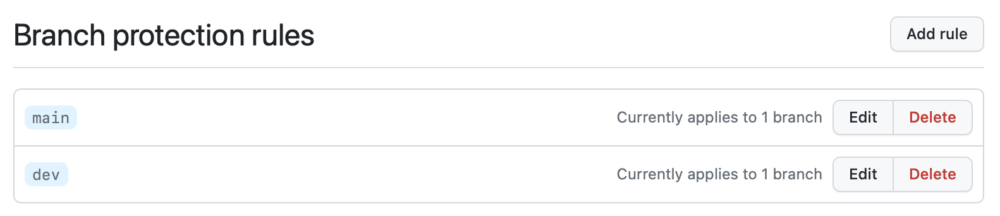

A network diagram for the branches can visualise how different branches function in this project. All implemented features are initially merged into the `dev` branch. At the end of each sprint, the completed version for release is merged into the `main` branch and tagged with a release tag. This process ensures a clear workflow and helps maintain the integrity of the codebase.

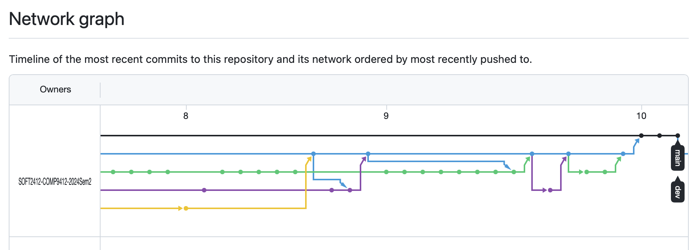

#### 3.1.3 Issues

In this project, issues primarily serve as a repository for user stories and sprint backlogs. However, regular issues can also be created to request assistance or report bugs.

Tags such as `help-wanted` and `enhancement` are used to categorise issues effectively, providing context and helping contributors understand the nature of the request.

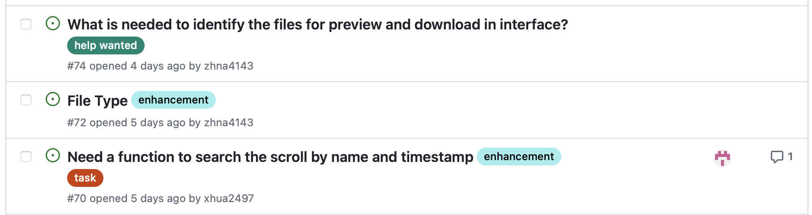

#### 3.1.4 Pull Requests

Pull requests (PRs) are essential for facilitating code reviews and collaboration within the project. They allow developers to propose changes to the codebase and initiate discussions regarding these changes before merging them into the `dev` branches.

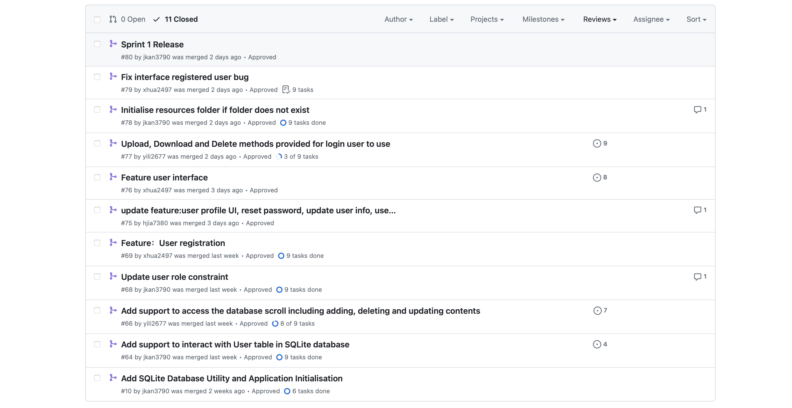

A pull request template is provided for developers to use. The template guides developers in detailing a short description, related user stories/tasks, the changes made, the testing conducted, and other information about the impact on the current sprint. This ensures that all necessary information is included for reviewers.

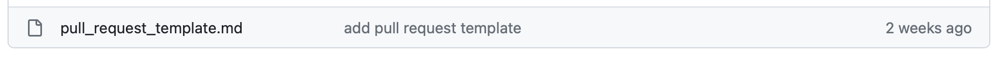

### 3.2 CI/CD: Gradle

Gradle served as the build automation tool for this project, managing dependencies, compiling code, running tests, and generating results. Here's an overview of how it was configured.

- **Plugins**:
	- `application` plugin: This plugin supports building and running Java applications directly from the command line. It simplifies the packaging process by specifying the main class (`VirtualScrollAccessSystem.App`), allowing for the easy creation of runnable applications and automating tasks such as executing the main class.
	- `jacoco` plugin: This plugin integrates JaCoCo, a code coverage tool that measures the coverage of JUnit tests. It generates coverage reports, helping ensure that the application code is thoroughly tested.

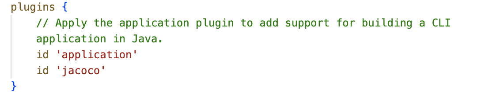

- **Repositories**:
	- `mavenCentral()`: Gradle pulls all required dependencies from the Maven Central repository, facilitating the download and management of external libraries.

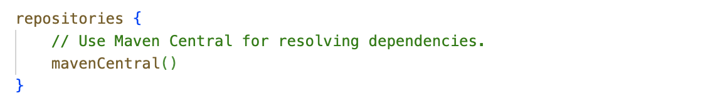

- **Dependencies**:
	- `testImplementation 'org.junit.jupiter:junit-jupiter:5.8.1'`: Adds JUnit Jupiter (JUnit 5) as a dependency for unit testing. JUnit Jupiter provides a structured framework for writing and executing tests.
	- `implementation 'com.google.guava:guava:30.1.1-jre'`: Integrates Google Guava, a library offering utilities for collections, caching, and string manipulation, making it easier to handle complex data structures and utility functions within the application.
	- `implementation 'org.xerial:sqlite-jdbc:3.46.1.3'`: Adds support for using SQLite as a database through the SQLite JDBC driver.
	- `implementation 'org.mindrot:jbcrypt:0.4'`: Incorporates the BCrypt library for password hashing, enhancing the security of user credentials.

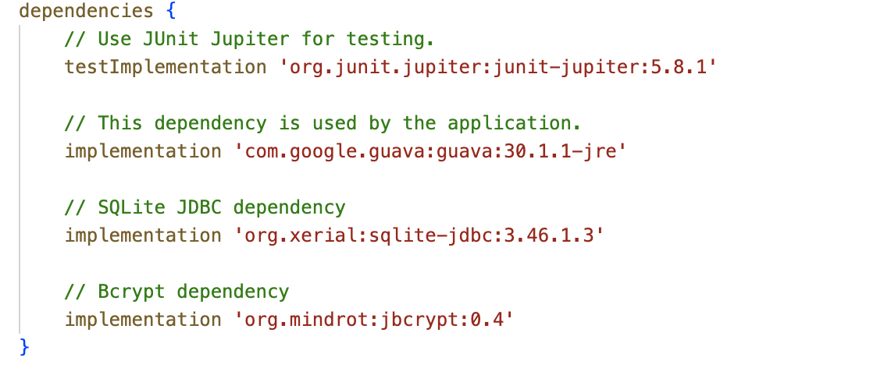

- **Application Configuration**:
	- `application.mainClass = 'VirtualScrollAccessSystem.App'`: Defines the main entry point as the `App` class within the `VirtualScrollAccessSystem` package, simplifying the execution of the application using Gradle.

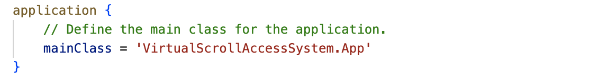

- **Testing**:
	- `test (JUnit test)` task: The test task utilises the JUnit platform (`useJUnitPlatform()`) for running unit tests with JUnit 5. Automated testing offers detailed feedback on test outcomes, ensuring the application behaves as expected.
	- `junitXml.required.set(true)` and `html.required.set(true)`: These configurations ensure that XML and HTML reports are generated for test results. The XML report is suitable for CI platforms like Jenkins, while the HTML report is convenient for developers to view in a browser.

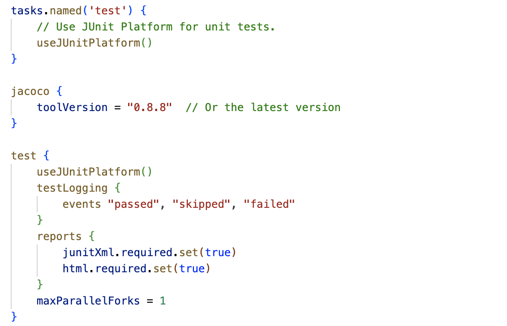

- **Code Coverage**:
	- `jacoco` and `jacocoTestReport`: The `jacoco` task utilises JaCoCo for measuring code coverage, while the `jacocoTestReport` task generates reports in XML and HTML formats. This helps track the percentage of code covered by tests, highlighting areas that need further testing.

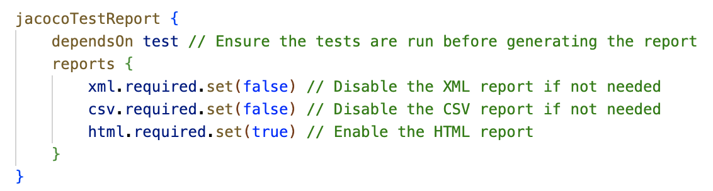

- **Custom Tasks**:
	- `run { standardInput = System.in }`: Configures the application to accept user input from the command line during execution, enabling real-time interaction with users.

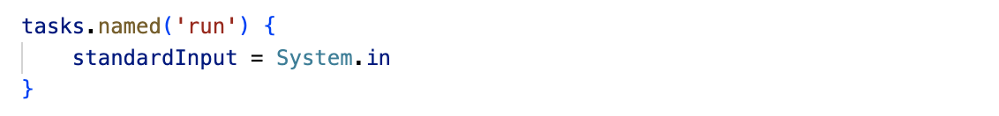

### 3.3 CI/CD: Jenkins

The Jenkins configuration in this program is developed following Edstem's tutorial, enabling web-hook communication between the local Jenkins instance and the GitHub repository using `ngrok http 8080`. Once connected, Jenkins automatically triggers builds and runs automated tests whenever code is contributed to the shared GitHub repository.

The Jenkins main page displays an overview of the current build status, recent activity, and available projects. The dashboard provides information such as the most recent builded `jar` file, recent test result, testing coverage trend line etc.

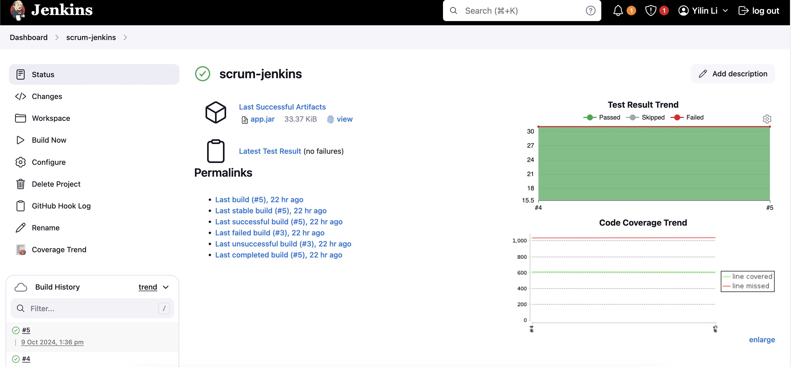

The test report generated by Jenkins offers detailed results of the automated tests run during the build process. It highlights any failures or errors encountered, enabling developers to quickly identify and address issues before merging changes into the main branches.

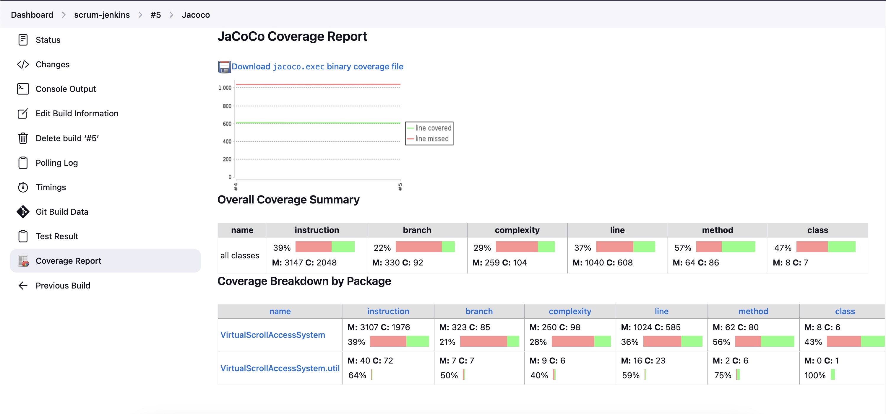

## Appendix

The appendix provides detailed information and documentation supporting the development and management of the Virtual Scroll Access System (VSAS).

It includes an overview of the group members and their specific Scrum roles, summarising each member’s contributions in sprint 1.
Additionally, it documents meeting records and relevant technical notes, ensuring a comprehensive view of the project’s progress and collaborative efforts throughout the development process.

### Group Members and Contributions

#### Product Owner

##### Yilin Li (yili2677)

As a product owner, I generate user stories and assign them to developers to work on. For example, the user story below is accompanied by multiple precise tasks to assign to developers, who can then begin their coding work with the assigned tasks and submit before the deadline. Also, after the sprint ended, I was a part of the team that communicated with the client about the challenges we encountered, recorded the new features the client requested, and completed the assigned task again in the next sprint.

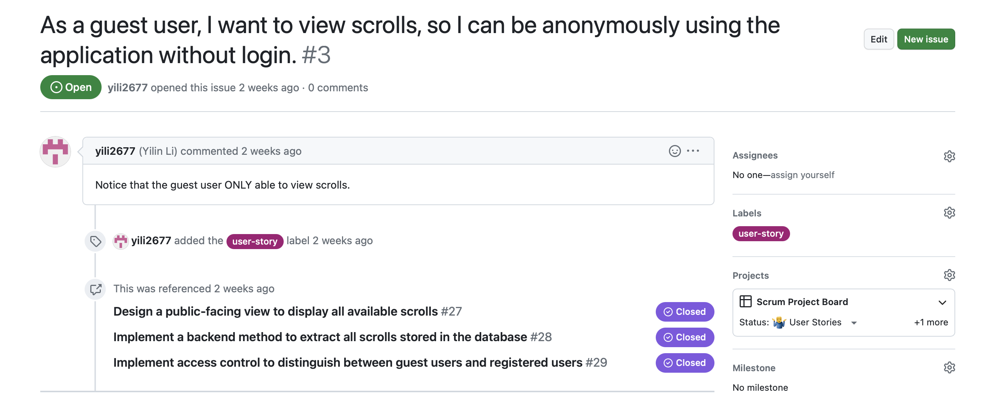

As a developer, for sprint 1, I implemented methods for creating, updating, and deleting scrolls in the Scroll database, ensuring binary content is stored using BLOBs. Additionally, methods were developed to retrieve scrolls by scroll ID, by user ID, and extract all scrolls stored in the database. These functionalities cover key backend operations for managing scroll content. 

#### Scrum Master

##### Junrui Kang (jkan3790)

As a Scrum Master, I worked to create a collaborative environment on WeChat group chat where team members can communicate openly and effectively during the development process. My role includes guiding the team in conducting daily stand-ups (see the screenshot below), and facilitating sprint reviews (see the previous section 2.4) and retrospectives to foster continuous improvement.

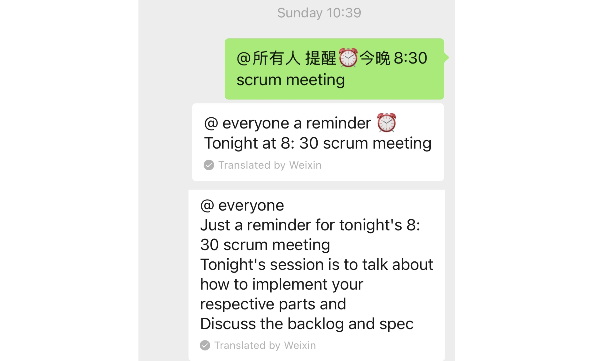

As a developer, in sprint 1, I mainly focused to the back-end database functions of the Virtual Scroll Access System. I added support for accessing the SQLite database and ensured that it initialises upon application launch. I implemented key functionalities for user management, including authentication and operations for adding, updating, deleting, and retrieving user information.

#### Development Team

##### Xinchen Huang (xhua2497)

In Sprint 1, I was responsible for designing the front-end interface,which includes the user panel and admin panel. Besides, I also respond to implement the back-end of the user registration. Verification and data statistics designed and front-end showing.

Evidence is in Below:

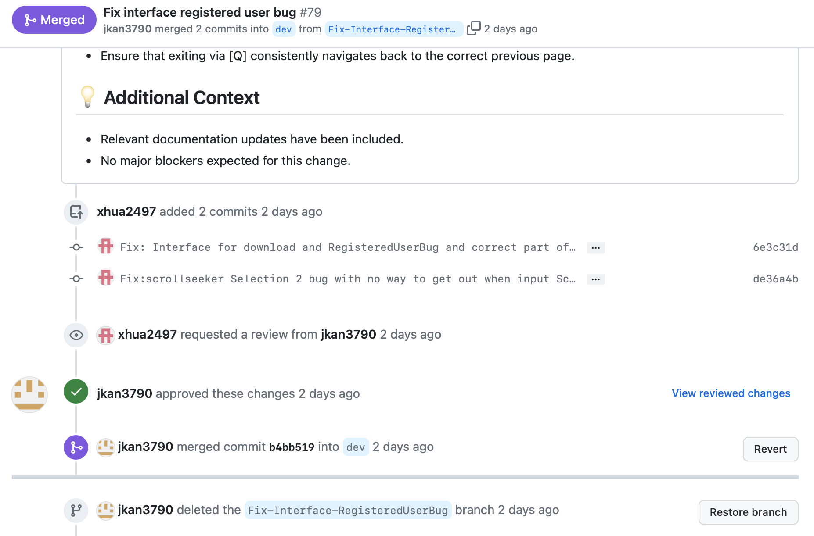

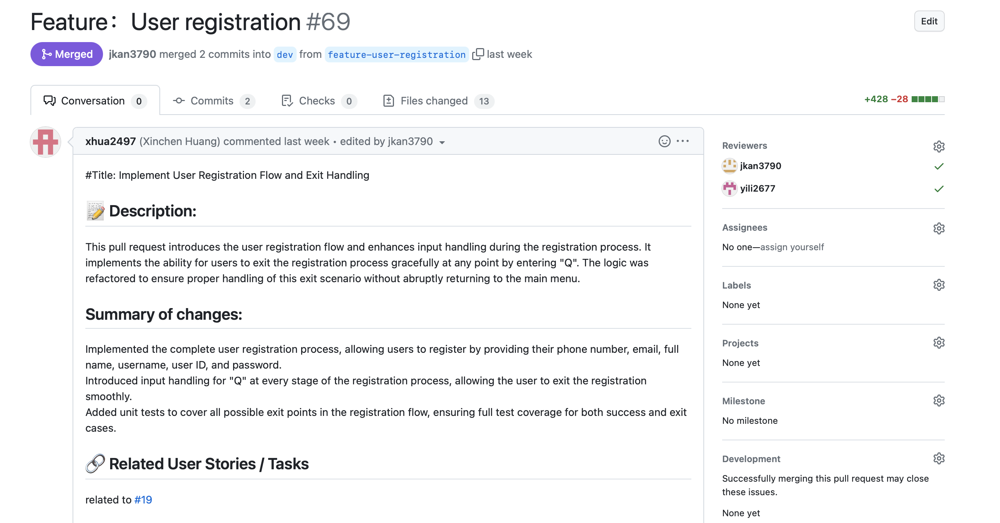

##### Huiying Jiao (hjia7380)

In sprint 1, I differentiated between registered users and guest users. I implemented the display of the user's name and type, as well as designed and integrated a user profile view that allows users to modify their profile (excluding the ID). I set restrictions and re-encrypted the passwords. I updated the UI for registered users' login and designed a public-facing view that displays all available scrolls.

##### Zhiyuan Na (zhna4143)

In sprint 1, I was responsible for implementing file upload, download, and deletion functionalities to ensure that users could manage files smoothly. Additionally, I optimised the file modification feature by designing two approaches: replacing the old file with a new one, or directly modifying the file content. After comparison, I chose the direct modification method to improve convenience and efficiency. And In sprint 1, I implemented the permission recognition for administrators, regular users, and unauthenticated users, and set up corresponding functionalities for uploading, downloading, deleting, and modifying files based on different permissions.

### Meeting Records

#### Sprint 0

| Time       | Duration | Description                                                                                                                            | Note                                                |
| ---------- | -------- | -------------------------------------------------------------------------------------------------------------------------------------- | --------------------------------------------------- |
| 2024/09/25 | ~10mins  | Decide scrum roles for each member.  Read the specification together to get a brief understanding of what to do for the project. | No recording as this is a short discord discussion. |

#### Sprint 1

| Time       | Duration    | Description                                                                                                                                                                                                                                                                                                                                                                                                                                                                                                                                      | Note                                                |
| ---------- | ----------- | ------------------------------------------------------------------------------------------------------------------------------------------------------------------------------------------------------------------------------------------------------------------------------------------------------------------------------------------------------------------------------------------------------------------------------------------------------------------------------------------------------------------------------------------------ | --------------------------------------------------- |
| 2024/09/29 | 20:30–21:00 | Introduce how to use GitHub to manage the Scrum project, including the demo of how to use the project board and how to view the backlogs.  Allocate works to developers.  Specify how the branch works in the repository, how to perform testing throughout the developing process and how to make contribution (pull request) to the development branch.  Recording: [link](https://uni-sydney.zoom.us/rec/share/C26F9hvemM9Ld0TjiXR78JrB5ic5NXPMvzvOrbyehSZKDoHpYGG21h1zRLVsxEfW.M7D45EuEDgpZuy1_)  Password: 6b0kT?zB |                                                     |
| 2024/10/01 | 20:30–21:00 | Discuss how the database works in this project.  Recording: [link](https://uni-sydney.zoom.us/rec/share/nFwZvk-u_X637pRqr9XoqHE_7vTMacBdvmDqfOMGj4O7CeAUqyzGlBau7Jhm7QCp.RpxGIKzuGeIo3vno)  Password: .E?D8YQy                                                                                                                                                                                                                                                                                                                       |                                                     |
| 2024/10/02 | 20:30–21:00 | Demonstrate individual progress.                                                                                                                                                                                                                                                                                                                                                                                                                                                                                                                 | No recording as this is a short discord discussion. |
| 2024/10/04 | 20:30–21:00 | Demonstrate individual progress.                                                                                                                                                                                                                                                                                                                                                                                                                                                                                                                 | No recording as this is a short discord discussion. |
| 2024/10/06 | 20:30–21:00 | Demonstrate individual progress.  Recording: [link](https://uni-sydney.zoom.us/rec/share/VG8IoE3xkEyk-7GUXjV4OLfqcMeexK7NthqtTHdJHIIQKb2SjeSVU8GxTQd916o.B5ER3KmFQnJfh89W)  Password: HD+u1tP3                                                                                                                                                                                                                                                                                                                                       |                                                     |
| 2024/10/07 | 20:30–21:00 | Demonstrate individual progress.  Discussed the inconsistency in the user interface among developers. Assigned team members to collaborate on creating a style guide to ensure coherence across the front end.                                                                                                                                                                                                                                                                                                                             | No recording as this is a short discord discussion. |
| 2024/10/08 | 20:30–21:00 | Demonstrate individual progress.  Recording: [link](https://uni-sydney.zoom.us/rec/share/PUXxro5EPQxToPI_N9g2ul5KjiBlpzMlvX_KIsrWrPryDiYqV_NrSVfqgWaXO_YR.B3UG2Bdvzvj8fare)  Password: %^@Nm0lX                                                                                                                                                                                                                                                                                                                                      |                                                     |

