# SOFT2412 Project Report - Sprint 2

>[!INFO] GitHub Repository
>Access the project repository on GitHub: https://github.sydney.edu.au/SOFT2412-COMP9412-2024Sem2/Steph_Lab11_Group01_Assignment2

>[!IMPORTANT] Individual Contribution
>A detailed account of my contributions and self-evaluation is available in the appendix of this report.

>[!IMPORTANT] Meeting Records
>Information about all meetings, including recording links, can be found in the appendix of this report.

<div STYLE="page-break-after: always;"></div>

## 1 Sprint Goal

In the second sprint of developing the Virtual Scroll Access System (referred to as VSAS throughout this report), our focus is on addressing bugs, enhancing features, and implementing new stakeholder requirements. Below is a detailed breakdown of our key sprint activities:

### 1.1 Sensibility

Fixing Bugs Identified in Sprint 1 Review Session:

- **Validating User Input**: Ensuring that user inputs, such as email addresses and phone numbers, conform to the expected formats to improve data integrity and user experience.
- **Validating File Formats**: Verifying the format of files when users upload or edit scroll files to prevent compatibility issues and maintain consistent data structure.
- **UI Bug Fixes**: Addressing other minor bugs found in the user interface to optimise the overall functionality and usability of the system.

### 1.2 Relevance

Enhancing Current Features and User Experience:

- **Preview Scroll Content**: Implementing a feature that allows users to preview scroll content before downloading, offering more flexibility and ensuring they select the correct files.
- **Search Functionality for Scrolls**: Enhancing the search feature by allowing users to search for scrolls based on attributes such as scroll name, uploader, and upload time (with a range filter). This will help users locate specific scrolls more efficiently.
- **Scroll Statistics**: Adding functionality for users to view statistics related to a particular scroll, including the number of times it has been uploaded and downloaded, providing useful insights into scroll popularity.

### 1.3 Clarity

Implementing New Feature Requested by the Stakeholder:

- **Daily Featured Scroll**: Introducing a new feature that displays a randomly selected scroll as the "Lucky Scroll of the Day." This randomly featured scroll is updated every day, encouraging users to engage with diverse content and increasing overall user interaction with the application.

These tasks form the core objectives of Sprint 2, driving us towards a more robust, user-friendly, and engaging version of VSAS.

<div STYLE="page-break-after: always;"></div>

## 2 Scrum Events and Artefacts

Scrum events and artifacts are essential components of the Scrum framework, providing structure, transparency, and continuous improvement throughout the development process. In this project, we adhere to these principles by implementing the following key Scrum events and artifacts:

- **Scrum Team Formation**: Earlier in the project, we defined clear roles and responsibilities within the team to establish a foundation for effective collaboration and accountability.
- **Meetings**:
    - **Sprint Planning Meetings**: At the start of each sprint, we outline the sprint goals and define the tasks necessary to achieve those goals.
    - **Daily Scrum Meetings**: These brief stand-up meetings occur daily, allowing the team to synchronise their activities, discuss progress, identify any obstacles, and plan their work for the day.
    - **Sprint Review Meetings**: At the end of each sprint, we review the work completed with stakeholders, gather feedback, and validate outcomes.
    - **Sprint Retrospective Meetings**: Conducted after each sprint, the team reflects on what went well, what didn’t, and how we can improve.
- **Writing User Stories and Sprint Backlogs**: User stories are created to document functional requirements and the desired outcomes.
- **Estimate Workload Using Story Points and Burndown Chart**: We estimate the complexity and effort of tasks using story points, allowing us to track progress with a burndown chart.
- **Performing Acceptance Tests and Code Reviews**: We perform acceptance tests and code reviews to verify that features meet the specified criteria and are functioning as intended.
- **Maintaining Product and Sprint Backlogs**: We maintain an up-to-date product backlog, prioritising user stories based on stakeholder needs and project goals.
- **Tracking Progress with Velocity Metrics**: To visualise the flow of tasks and monitor the team’s progress, we track team velocity to measure the amount of work completed in each sprint.

<div STYLE="page-break-after: always;"></div>

### 2.1 Scrum Team Revisited

>[!CITE] Reference
>Please refer to Sprint 1 report (section 2.1) to see the team formation process.

In this project, to establish an effective Scrum team, the following roles and responsibilities are defined:

- **Product Owner**: The Product Owner is responsible for defining the features of the product and ensuring that the team delivers value to the stakeholders.
  - Contribution to VSAS Sprint 2:
    - Communication with the client: This is a important role for the product owner through fact-to-face way to talk with the client, and catch out the expected target (e.g, UI/feature changes) they want, and then "translate" into the way that group developers are able to understand.
    - New User story creation: The product owner should create the user stories after discussing with the client. 
    - New tasks sending: With the previous process, a good division of tasks to developers is also an essential role for the product owner to lead with them to finish the sprint.
- **Scrum Master**: The Scrum Master facilitates the Scrum process and ensures that the team adheres to Agile principles.
  - Contribution to VSAS Sprint 2:
    - Task follow-up: As a scrum master, following with the progress of the task is really important. It influences the whole process and makes sure each developer doing on the right track without missing understanding.
    - Team Meeting Starter: Another role of a scrum master needs to conduct every daily meeting and assists with the product owner that checks the progress of each developer's work and whether the direction of understanding is consistent with the general picture.
    - Team cohesion: The scrum master sometimes may be a character who promotes team cohesion by inspiring every developer. The scrum project focuses on teamwork, so this is also important.
- **Development Team**: This is a group of professionals with coding skills necessary to deliver the product increment.
  - Understanding: A good developer should have to brainstorm the methodologies how they solve assigned task.
  - Communicating: As the group work, the communication in the team cannot be missed which ensures the coding coverage each taken and the whole complexity of the project. Also, some small points like the coding style should be talked between developers tha can be modified at the first time.
  - Testing: This is one of the important points working on the group that could be easily missing. Each developer should write the basic JUnit testcase for their implemented methods. This can minimise the risks happening during the code generating and quickly find out the issue parts. Otherwise, it could generate the massive working to fix a tiny coding bug.

| Name (Unikey)            | Scrum Role                      |
| ------------------------ | ------------------------------- |
| Yilin Li (yili2677)      | Product Owner, Development Team |
| Junrui Kang (jkan3790)   | Scrum Master, Development Team  |
| Xinchen Huang (xhua2497) | Development Team                |
| Huiying Jiao (hjia7380)  | Development Team                |
| Zhiyuan Na (zhna4143)    | Development Team                |

In Sprint 2, these roles remain unchanged, providing continuity and allowing team members to build on their expertise. The Product Owner and Scrum Master continue to contribute as part of the Development Team, effectively balancing their primary responsibilities with hands-on development work. This dual-role approach enhances the team's cohesion and ensures that critical tasks receive attention without sacrificing the agile processes crucial to the project's success.

<div STYLE="page-break-after: always;"></div>

#### 2.1.1 Sprint 2 Group Member Contribution

##### Product Owner: Yilin Li (yili2677)

As the product owner, after sprint 1 finished, I communicated with the client during a tutorial (Thursday 10/10/2024 around 8:40 a.m). During the demo, the client has provided the new feature that needs to be updated and points out some errors that need to be fixed. As the sprint 1 demo, the client points out there should be the user information format checking (e.g., a phone number can be strictly an Australian phone number type). Also, the preview and filter features mentioned in sprint 0 should be quickly implemented. After that, the client wants a new feature that will allow the program to generate a random daily scroll with content that cannot be changed during an actual date.

In order to reach the target that the client wanted, firstly I conducted into the user story in such format: “As a/an xx, I want to xx, so I can xx” for developers easily to understand and clarify how to split the tasks for backends and frontends. Therefore, the user story #81 is published into the scrum project and ready for the sprint 2 task build. And previously created user stories #17, #15 are moved into this sprint to continue implementing.

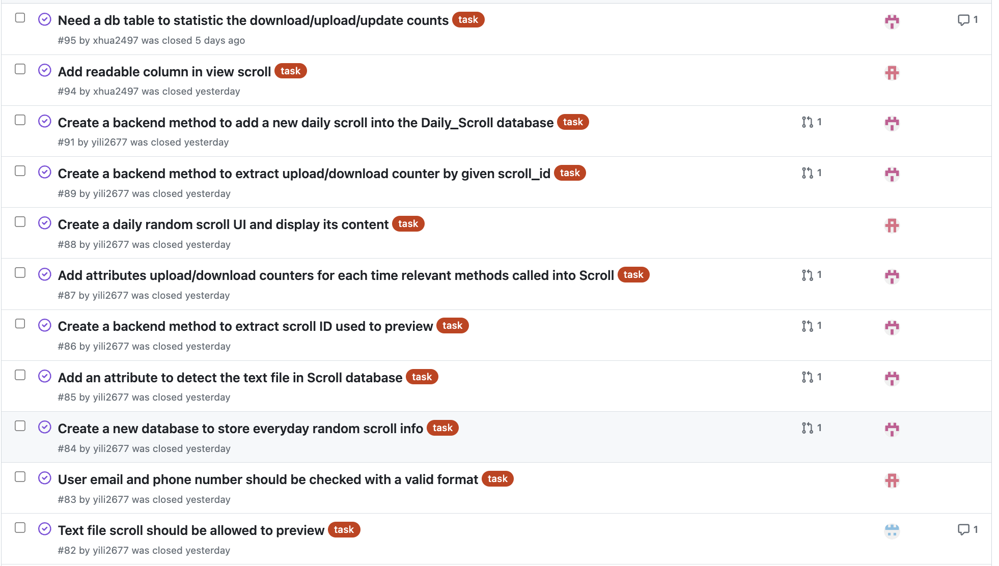

Based on considering how the developers understand what features the client expected and how to use the code language to implement them. I have sent a range of tasks based on the user stories that need to be worked on in sprint 2 with assignees and approximate method logic and method name. At this stage, the developers can quickly get started on the project construction and then communicate with other developers to facilitate collaborative decision-making. Therefore, several tasks are set up.

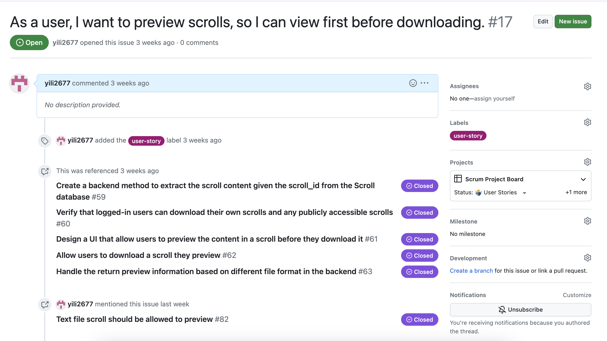

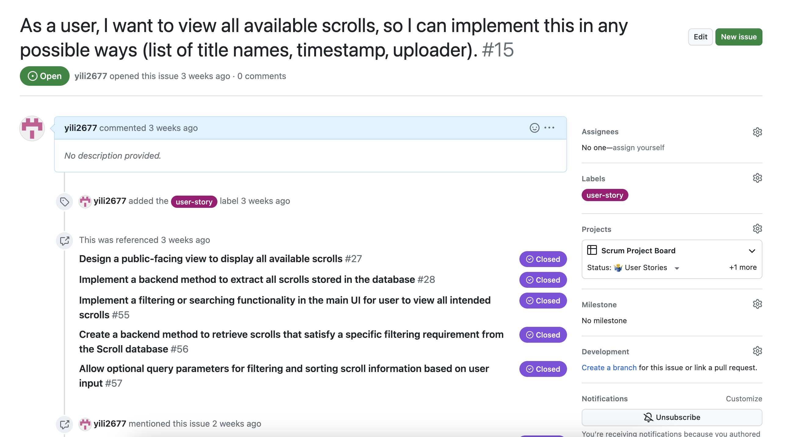

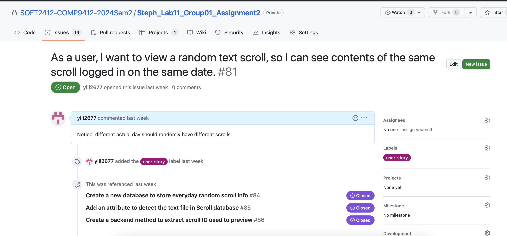

As the backend developer, I have implemented a Daily_Scroll database [`createDailyScrollTable` on `Setup.java`, `addDailyScroll`, `getScrollIDOfTheDay`], which is utilised on storing the date and scroll ID related to the Scroll database for finding the valid text scroll for content viewing [`searchScrollInfoByUploader`, `searchScrollInfoByTimeRange`, `searchScrollInfoByName`]. Also, the getting queries for filter methods based on given scroll ID, date range and user ID or name for the front ends to call and return the scroll information. And I have inserted the new attributes on the Scroll database and also for statistic retrieval [`getAllTextScrolls`, `getScrollStatistics`, `updateDownloadCounter`, `updateUploadCounter`].

<div STYLE="page-break-after: always;"></div>

##### Scrum Master: Junrui Kang (jkan3790)

As the scrum master, after the product owner published the tasks for this sprint 2, I have developed the new scrum meetings schedule with the team. I assisted with the product owner to build up the new sprint backlogs and double-check the validation of each task description as long as it becomes reasonable. Furthermore, I have independently communicated with every developer to ensure they have fully understood the goal of their assigned tasks.

For the team meeting, I have come up with totally three types: sprint planning meetings, daily scrum meetings, and sprint review meetings. Different meeting types have different roles, which ensures that under the scrum project the risks and the percentage of redo become lowest. Before each meeting starts, I would remind everyone at the beginning of the date and also take notes for the bugs that needed to be fixed coming up with the team meeting. In addition, at each meeting, I have recorded to ensure some unpredicted situations happen or any developers forget their extensions developed on the team meeting.

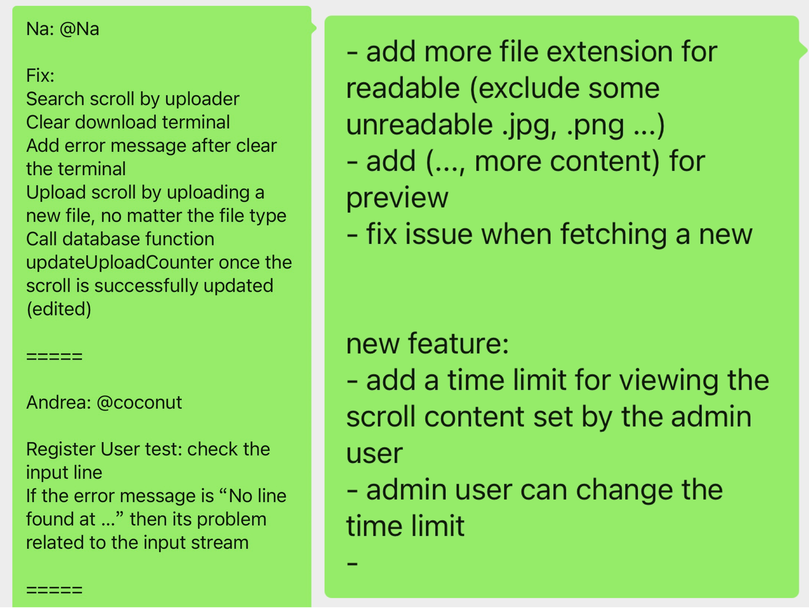

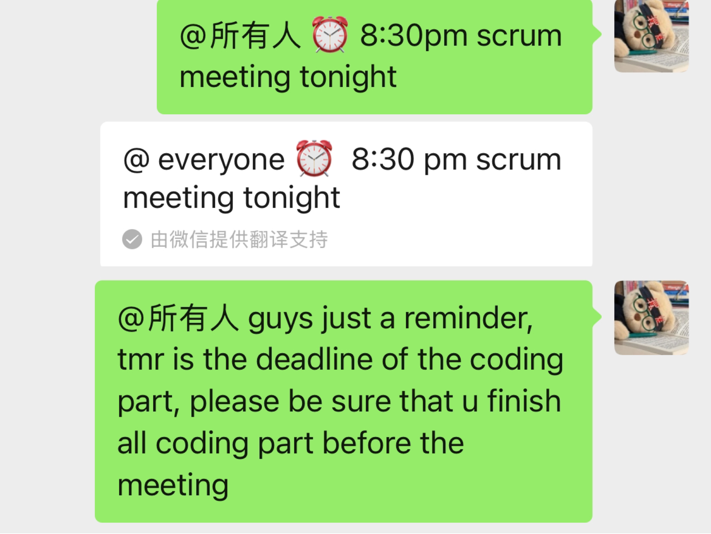

Finally, sometimes I take the role of team cohesion. This commonly happens when two or more developers come with different brainstorming and start to argue. Then I need to moderate the atmosphere to ensure that emotions are minimised.  
As the developer, I implement the backend role on the scroll preview methods. To consider that the preview needs to display at least 20 characters on the screen, then the methodology is performed to return the text content [`getAllTextScrolls`, `getScrollPreview`].

<div STYLE="page-break-after: always;"></div>

##### Development Team: Xinchen Huang (xhua2497)

During Sprint 2, I was responsible for implementing the front-end of the "PickLuckyScrollForDay" method, as required by the client. Additionally, I developed the front-end for the "Preview Scroll" feature, enabling users to have a clearer view of the details within their selected scroll. Besides, I also fix some bugs for validation, registration and Search Scroll Prompt.

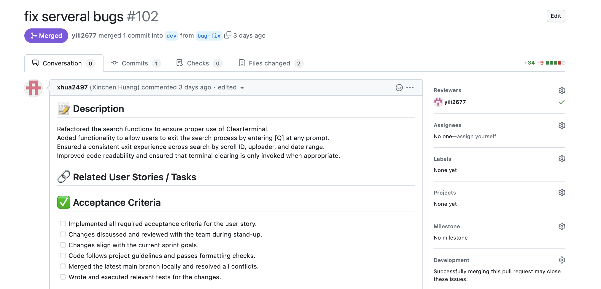

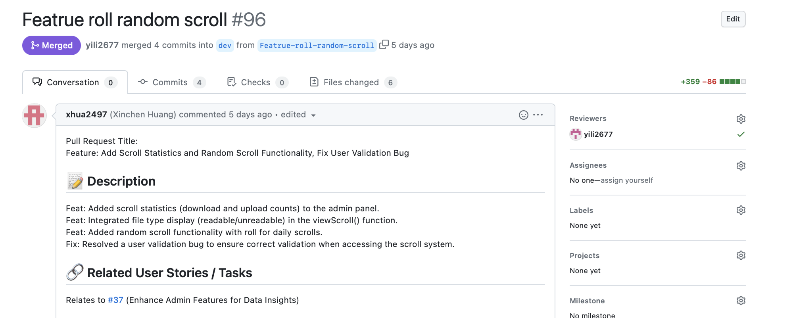

<div STYLE="page-break-after: always;"></div>

##### Development Team: Huiying Jiao (hjia7380)

In sprint 2, I focused on updating registered users, refining registration limitations and format. I also tested profile updates and the registered user files, enhancing test coverage to ensure all key functionalities were properly validated.

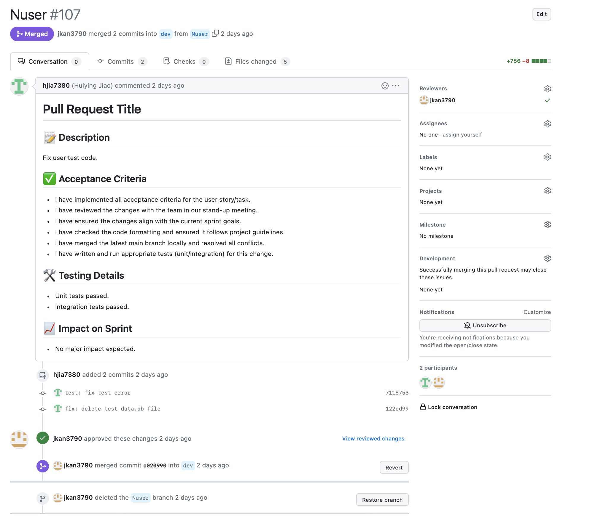

<div STYLE="page-break-after: always;"></div>

##### Development Team: Zhiyuan Na (zhna4143)

In Sprint 2, I implemented the searchScroll method, which includes three search options based on scroll ID, uploader, and date range, along with its UI. Additionally, I optimized the UI of the downloadScroll and editScroll methods, which I was previously responsible for. The main improvements include clearing the screen before each navigation and minimizing the use of Y/N questions, instead using options like 1, 2, 3. Furthermore, to enhance the user experience, I added a preview function before downloading. This allows users to preview a file before deciding whether to download it .Changed the method for 'Update' by replacing the original file content modification with changing the file, i.e., uploading a new file.

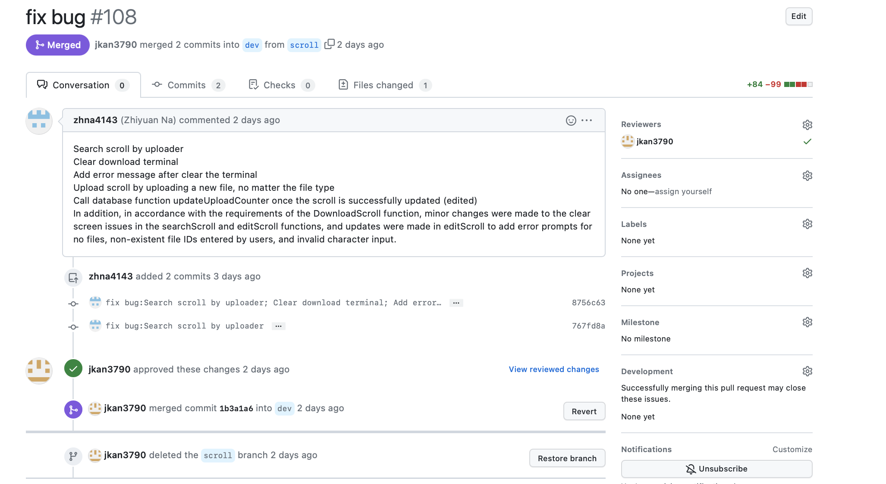

<div STYLE="page-break-after: always;"></div>

### 2.2 Meetings

Effective communication and coordination are critical to the success of our project, and various Scrum meetings are conducted to ensure alignment, progress tracking, and continuous improvement.

#### 2.2.1 Sprint Retrospective Meetings (for Sprint 1)

>[!IMPORTANT]
>This meeting can be found in the meeting record in the appendix.

The Sprint Retrospective for Sprint 1 was held right after the review meeting with the stakeholder (tutorial), focusing on identifying what went well, what didn’t, and areas for improvement in the Sprint 1.

Several potential issues of the application were detected during the review session, and they have been categorised as follows:

- It was observed that user inputs, such as email addresses and phone numbers, did not always conform to the expected formats. This inconsistency poses a risk to data integrity and can negatively impact the user experience. To address this, input validation mechanisms are being enhanced to ensure that all data entered meets predefined standards, reducing the likelihood of incorrect data entries.
- Another issue identified was the need for verifying file formats when users upload or edit scroll files. Incorrect file formats can lead to compatibility issues on preview functionality. To prevent this, we are implementing a file format validation system that checks for compatibility and consistency before any file is accepted or modified.
- Minor bugs and inconsistencies were also detected in the user interface, affecting usability and the overall user experience. These issues range from misaligned elements to inconsistent behaviours across different screens. Addressing these bugs is a priority to optimise the system's functionality and provide a smooth and intuitive interface for users.

The team also reflected on the individual collaboration, discussed the efficiency of their processes, and shared insights on challenges faced. Key action items from the retrospective included refining the bug tracking process and improving communication between team members.

These insights were carried forward into Sprint 2 to enhance team performance.

<div STYLE="page-break-after: always;"></div>

#### 2.2.2 Sprint Planning Meetings

>[!IMPORTANT]
>This meeting can be found in the meeting record in the appendix.

##### 2.2.2.1 Correctness

Sprint Planning Meeting is conducted at the beginning of the Sprint 2 to define the sprint goal and establish a clear plan for achieving it. In this sprint, the Sprint Planning meeting happened on Friday (the day after the tutorial).

The team reviews the product backlog, selects high-priority user stories, and breaks them down into actionable tasks in the scrum project board. During the sprint planning meeting, the team also estimates story points for each task and discusses potential risks or obstacles that might impact the sprint.

For Sprint 2, the team focused on fixing bugs identified in Sprint 1 (as detected in the Sprint Retrospective meeting), enhancing existing features (previewing, searching and viewing scroll statistics), and implementing new functionalities as requested by stakeholders (the lucky daily scroll).

##### 2.2.2.2 Completeness

As the following figure shown, the correctness tasks discussed through this meeting for sprint 2 are labelled with the assignees and waits to be solved in the well-defined `Backlog - Not Ready` section. Before the group deadline finished, each developer must finish their tasks and ensure its correctness as required. 

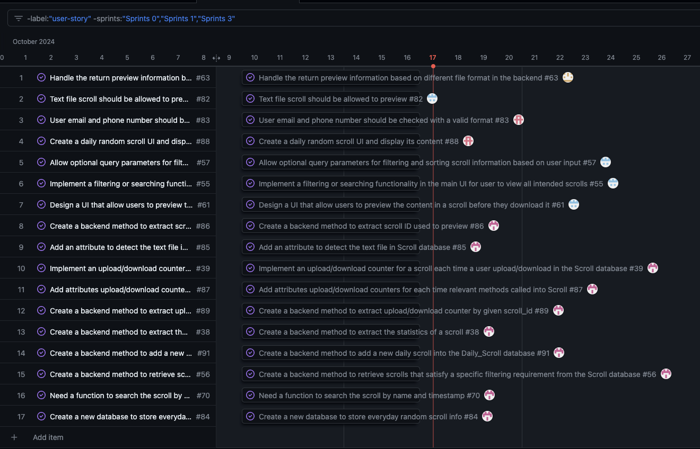

Therefore, with no doubt, those tasks can be moved into `Backlog - Ready` by the product owner and wait to begin with as the second image displayed. The `#94` task has been assigned to `xhua2497` developer, and then he can be able to manage his own progress for this task during sprint 2. 

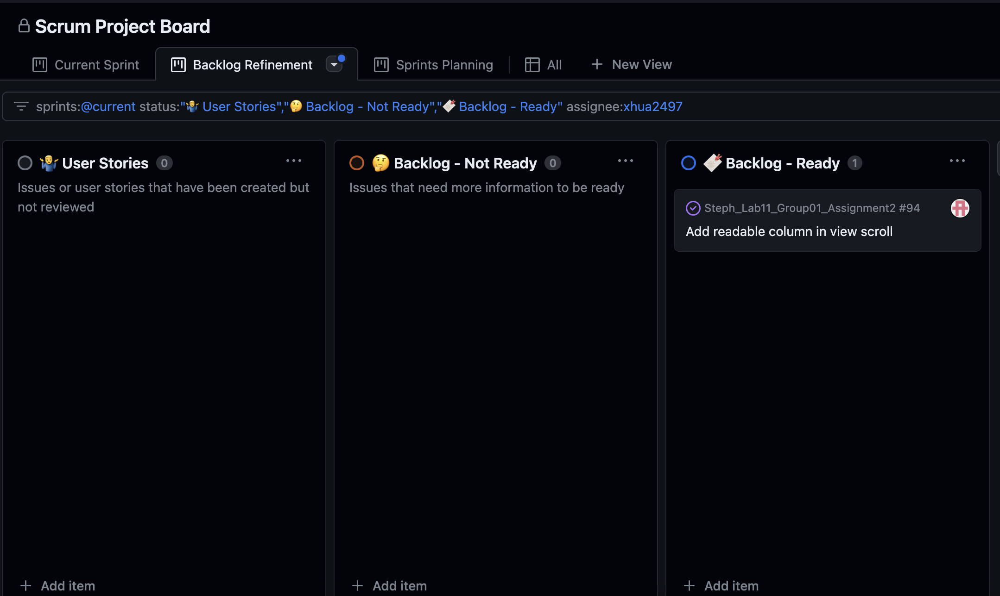

<div STYLE="page-break-after: always;"></div>

##### 2.2.2.3 Challenges/Issues

In this sprint, the challenges and issues are solved during the start planning meeting. One of the challenges that is the construction of the new daily scroll database, which is discussed by two backend developers (`jkan3790` and `yili2677`). Like the below shown, a lofi-prototype for the new database structure are discussed during the meeting.

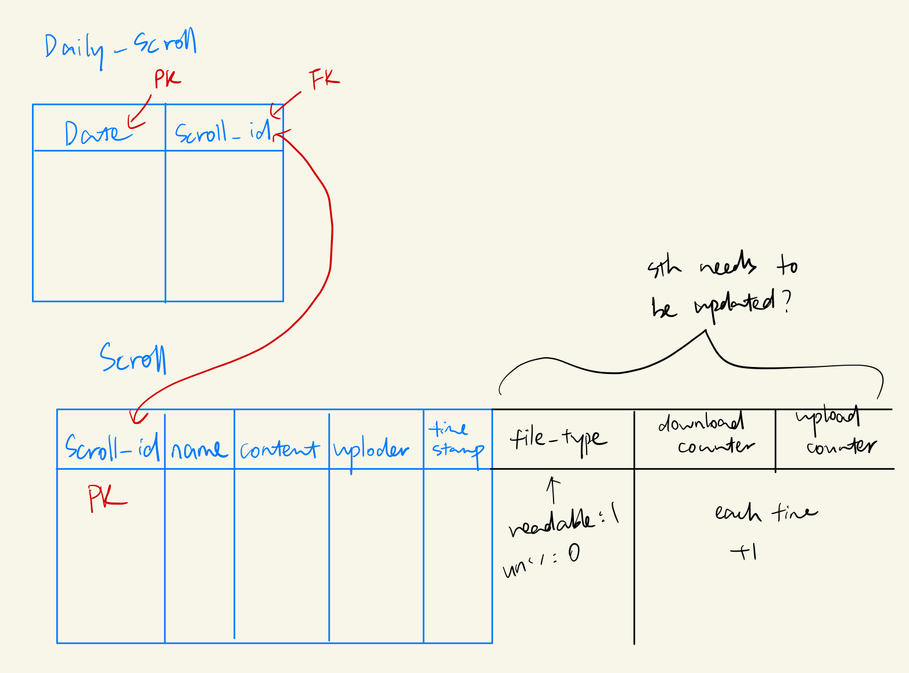

<div STYLE="page-break-after: always;"></div>

#### 2.2.3 Daily Scrum Meetings

>[!CITE] Reference
>Please refer to Sprint 1 report (section 2.3.2) to see the detail of daily scrum meeting.

>[!IMPORTANT]
>These meetings can be found in the meeting record in the appendix.

##### 2.2.3.1 Relevance

Upto this section, every developer's task should be put inside the `In Progress` section of the sprint 2 (an example task shown below). This clearly demonstrates that developers start to implement the code methodologies to focus on their tasks. After that, the product owner and scrum master should examine on those `In Progress` tasks during the daily scrum meetings.

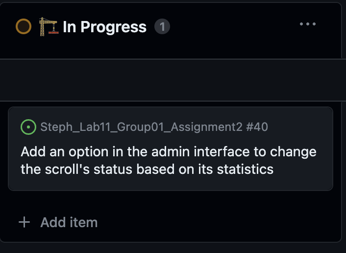

<div STYLE="page-break-after: always;"></div>

##### 2.2.3.2 Clarity

Daily Scrum Meetings are held to maintain alignment and transparency among team members. Similar to the Sprint 1, all team members have agreed to hold three formal online meetings each week, taking place on Zoom at the following times:

- Every Monday night 8:30pm
- Every Tuesday night 8:30pm
- Every Sunday night 8:30pm

For these meetings, the scrum master needs to inspect on:

- Runnable Demo or explanation on developer methodologies
- Questions faced (any developer could answer if they know how to solve)
- Developer idea inspiration (check with all group members to consider the reasonable)
- Suggestions (e.g., error fix way & refactoring)

#### 2.2.3.3 Challenges/Issues

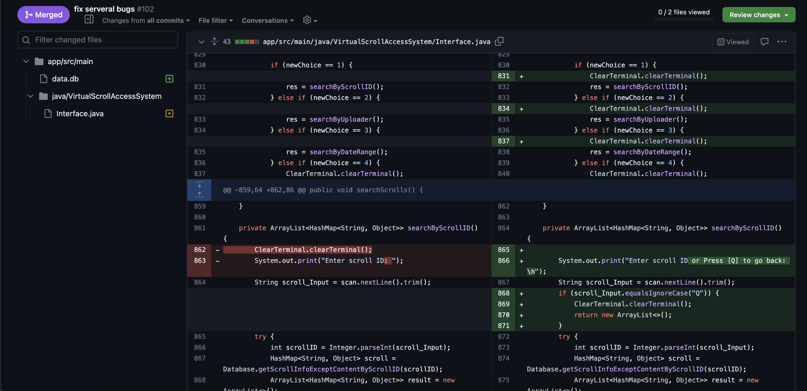
The most issues in sprint 2 faced that is the developer collision of ideas. As above merged branch has resolved the bugs existed on the frontend. The main reason to cause this issue happened is the understanding and coding styles are different between two developers. Therefore, the daily scrum meeting would fix this issues and check with the scrum master and product owner as the final accepted argument.

<div STYLE="page-break-after: always;"></div>

#### 2.2.4 Sprint Review Meetings

##### 2.2.4.1 Sensibility

The Sprint review meeting happens at the end of each sprint (Thursday in the tutorial) and provide an opportunity for the team to showcase completed work to stakeholders. During this meeting, the team presents the increment and demonstrates its functionality. The team demonstrates the product increment, including new features and bug fixes, and gathers feedback.

In our recent Sprint Review Meeting, the tutor, acting as our stakeholder, provided several key pieces of feedback. These insights are crucial for refining our application and enhancing the overall user experience. The feedback received includes:

- **Bug Detected about Lucky Scroll of the Day**: A bug was identified when accessing a deleted "Lucky Scroll of the Day." Currently, if the daily scroll has been deleted, the application does not automatically fetch a new scroll; instead, it throws an exception. This issue needs to be resolved so that the application can dynamically select a new scroll if the previously featured one is unavailable.
- **Support for More File Types in Previewing**: At present, the application only supports previewing `.txt` files. However, the stakeholder noted that in real-world scenarios, users may want to preview various file types, such as `.py`, `.java`, `.c`, and others. To meet this requirement, the application should be extended to support a broader range of file extensions for previewing, making it more versatile and user-friendly.
- **User Experience When Previewing Scroll**: The application currently displays a maximum of 30 words when previewing scroll content. If the content exceeds this limit, it is cut off without any indication, which can confuse users. To improve the user experience, the application should clearly indicate whether the previewed content is complete or provide an ellipsis ("...") or "continued" message when the content is truncated.
- **Scroll Previewing Time Limit**: The stakeholder also requested a new feature that allows the admin user to set a time limit for scroll previews. This time restriction would limit how long a user can preview the scroll content before access is restricted each time. The admin user should have the ability to modify this time limit within the application settings, offering flexibility and control over the previewing feature.

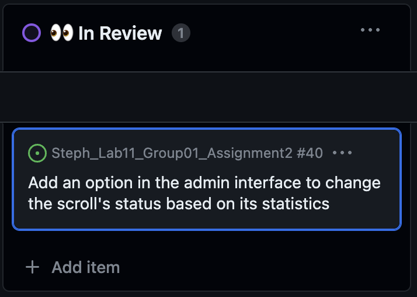

The task should be moved into the `In Review` in this section, when the assigned tasks are solved and add the pull request waiting for the reviewers checking (the product owner and scrum master) no issues, then merged into the `dev` branch. To ensure the correctness of the coding and avoids high risks, a pull request format has been inspired by the scrum master (`jkan3790`) for the developer self checking before merging shown below.

This format significantly deserves in this scrum project, and points a clearly self-checking way for developer instead of directly pull a request without protecting coding correctness. As well as the linked user stories can easily for other developers to quickly catch what features implemented on this commit.

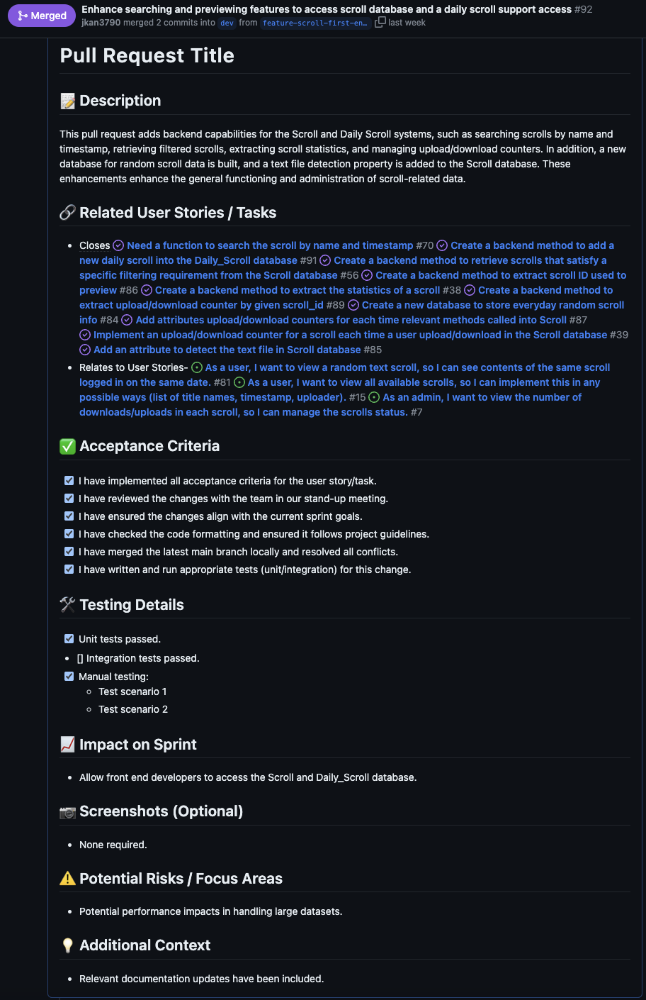

##### 2.2.4.2 Challenges/Issues

Under this section is the high point of the issues happened. As code is pushed in from different developers, the overall code complexity increases. Thus, the scrum master and product owner are more focused on the coding correctness and conflicts solving during this sprint review meetings.

<div STYLE="page-break-after: always;"></div>

#### 2.2.5 Challenges/Issues and Conflict Resolution

There exists a few issues and conflict in this sprint 2 during merging branches. Excepting the range of small bugs fixing, three significant issues are listed as the following:

**1. Merged into the wrong branch**

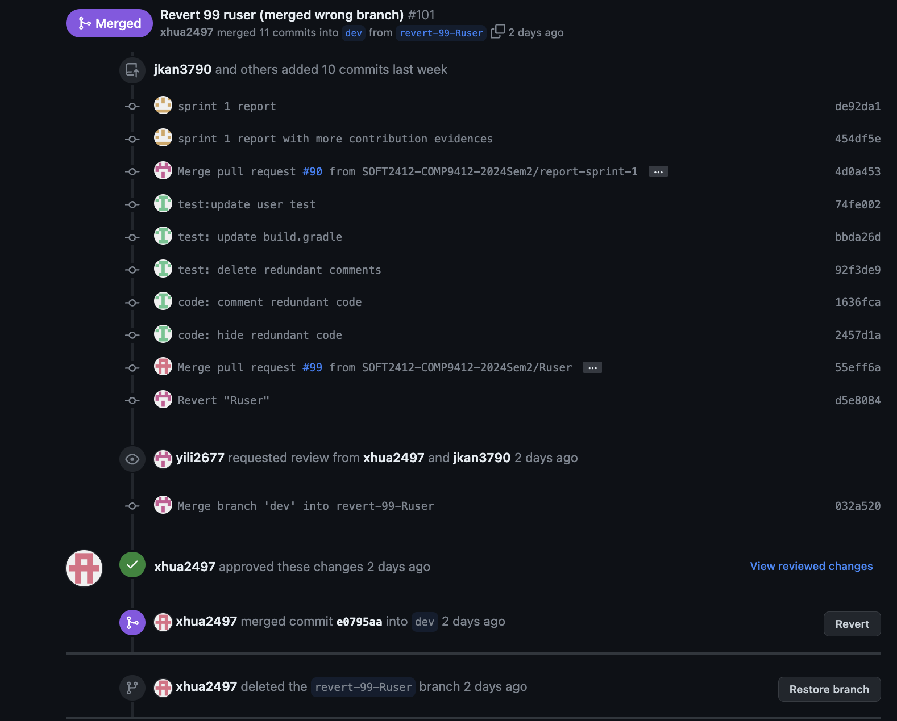

The first issue is merged into the wrong branch. As the scrum project, the target goal is every single developer created their own branches under the `dev` branch. Until all assigned tasks during current sprint has been solved then should merge their `feature-sth` branches into `dev` branch.

However, as above `hjia7380` made a pull request to merge into the `main` branch and approved. This is an issue happened on both requester and reviewer. Therefore, a possible improvement would be to require a double review by both the product owner and the scrum master for a successful merge in future sprints.

<div STYLE="page-break-after: always;"></div>

**2. Code duplication**

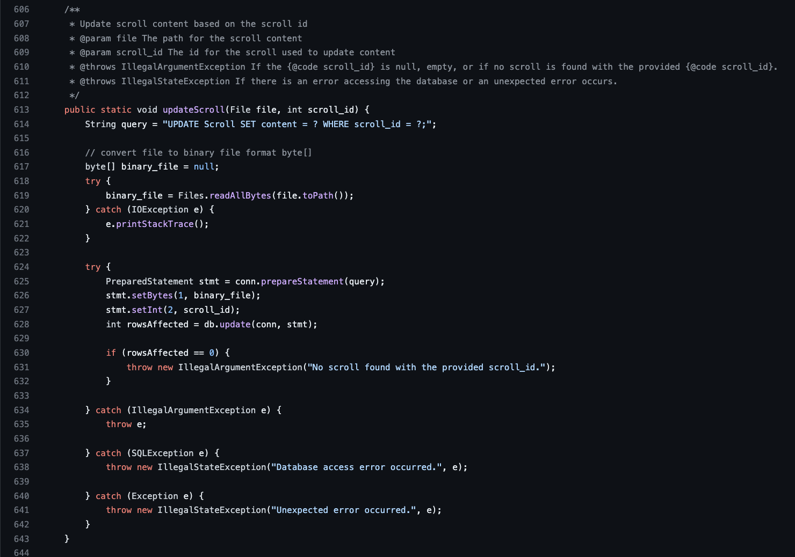

The second issue is the code duplication. As the first image shown that the `updateScroll` methodology is implemented by `yili2677` already merged into `dev` branch. However, as the second image indicated the pull request on `zhna4143` branch has implemented a duplicated methodology called `updateScrollContent`.

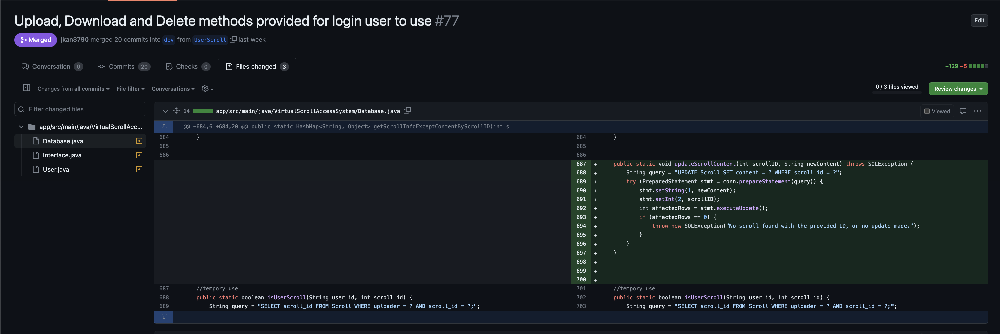

Among the two developers, one belongs to the frontend (`zhna4143`) and the other to the backend (`yili2677`). This problem was attributed to the lack of timely communication between the developers and the lack of clarity in their individual tasks, which led to duplication of code functionality. One of the ways to solve this problem for future sprints is to improve communication between developers in daily scrum meetings and to give some motivation to the scrum master in meetings.

<div STYLE="page-break-after: always;"></div>

**3. Code contribution confusion**

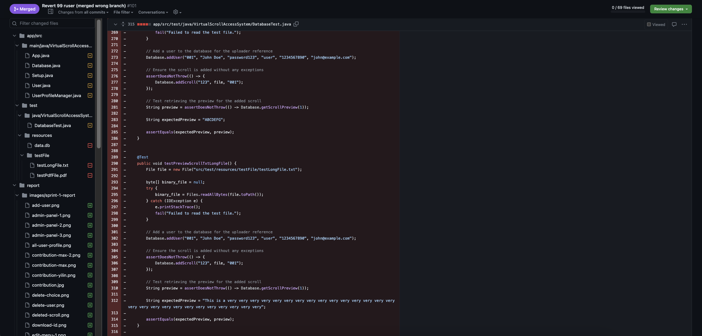

The last issue is the code contribution confusion. This happened when reverted the first issue. As the pushed code by `hjia7380` is a couple of dates behind, then previous pushed code were deleting during the code conflict by the reviewer as shown above. Therefore, the code contribution becomes confusion as the data is complemented by the scrum master. 

This also an issue due to both developer and reviewer without checking properly. To solve those issues, the reviewer numbers should increase into at least 2 approved to double sure the correctness.

<div STYLE="page-break-after: always;"></div>

### 2.3 Estimation and Progress Tracking

#### 2.3.1 Story Point Voting

The story points for backlogs in this sprint 2, totalling 21 points, are voted on by all group members. The following descriptions can be used to explain the tale points based on their range and complexity level.

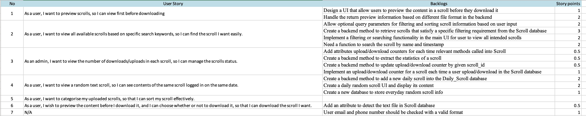

Each user story has been segmented into several components for detailed utilisation in sprint 2, facilitating a division of labour between frontend and backend developers. Consequently, the total story point range covers a minimal scope without compromising code complexity (Noticed that the not covered user story will be moved into the next sprint if still in need).

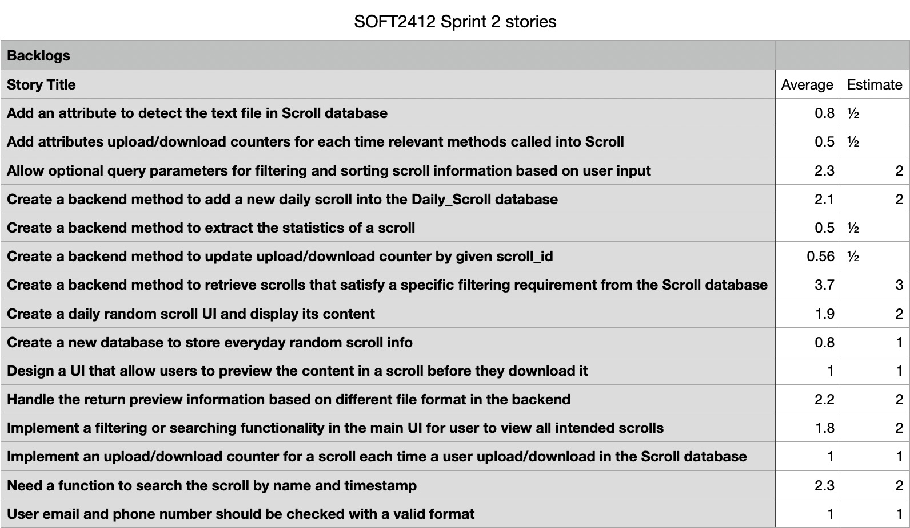

<div STYLE="page-break-after: always;"></div>

##### 2.3.1.1 Preview Related

>[!QUESTION] Backlog
>Add an attribute to detect the text file in Scroll database (Estimated: 0.5 pts)

This story involves implementing a minor update that checks whether the file extensions in the Scroll database are.txt files. The code complexity is low since it simply includes a method for checking file ending types and determining whether they are readable (in this example, text files with the.txt file). 

Given the simplicity and minimal risk/effort involved, the estimated story points for this backlog item is 0.5 points.

>[!QUESTION] Backlog
> Design a UI that allow users to preview the content in a scroll before they download it  (Estimated: 1 pt)

This story involves implementing a user previewing UI with the first 20 characters of content for all readable files (related to backlog 1) with the given scroll ID. The code complexity is low since it generally requires a new feature on user option extensions. 

Given the simplicity and minimal risk/effort involved, the estimated story points for this backlog item is 1 point.

>[!QUESTION] Backlog
> Handle the return preview information based on different file format in the backend  (Estimated: 2 pts)

This story involves implementing the obtaining query to retrieve information and create a watching scroll table for visitors to select previewing content (related to backlog 10). The code complexity is moderate since it generally requires a new feature on SQLite database extensions. 

Given the efforts straightforward and manageable risk/effort involved, the estimated story points for this backlog item is 2 points.

<div STYLE="page-break-after: always;"></div>

##### 2.3.1.2 Scroll Statistics Related

>[!QUESTION] Backlog
> Add attributes upload/download counters for each time relevant methods called into Scroll (Estimated: 0.5 pts)

This story involves implementing two attributes for recording the number of upload/download scrolls into the Scroll database. The code complexity is low since it simply inserts attributes based on SQLite usage that are similar to the database creation (implemented in Sprint 1). 

Given the simplicity and minimal risk/effort involved, the estimated story points for this backlog item is 0.5 points.

>[!QUESTION] Backlog
> Create a backend method to extract the statistics of a scroll (Estimated: 0.5 pts)

This story involves implementing the getting query for the number of upload/download scrolls into the Scroll database. The code complexity is low since it simply inserts attributes based on SQLite usage that are similar to the database query (implemented in Sprint 1). 

Given the simplicity and minimal risk/effort involved, the estimated story points for this backlog item is 0.5 points.

>[!QUESTION] Backlog
> Create a backend method to update upload/download counter by given scroll_id (Estimated: 0.5 pts)

This story involves implementing the updating query for the number of upload/download scrolls into the Scroll database. The code complexity is low since it simply updates attributes based on SQLite usage that are similar to the database query (implemented in Sprint 1). 

Given the simplicity and minimal risk/effort involved, the estimated story points for this backlog item is 0.5 points.

<div STYLE="page-break-after: always;"></div>

>[!QUESTION] Backlog
> Create a backend method to retrieve scrolls that satisfy a specific filtering requirement from the Scroll database (Estimated: 3 pts)

This story involves implementing the searching query based on the user inputs (related to backlog 3) with preferred filtering type selections (date range, uploader, scroll ID) to query scroll information employing for UI display. The code complexity is moderate since it generally requires a new feature on database querying extensions. 

Given the efforts straightforward and manageable risk/effort involved, the estimated story points for this backlog item is 3 points.

>[!QUESTION] Backlog
> Implement an upload/download counter for a scroll each time a user upload/download in the Scroll database (Estimated: 1 pt)

This story involves implementing at the frontend UI to illustrate counters by called method provided (related to backlog 5). The code complexity is low since it generally requires a new feature on user statistics data extensions. 

Given the simplicity and minimal risk/effort involved, the estimated story points for this backlog item is 1 point.

<div STYLE="page-break-after: always;"></div>

##### 2.3.1.3 Filter (Search) Related

>[!QUESTION] Backlog
> Allow optional query parameters for filtering and sorting scroll information based on user input (Estimated: 2 pts)

This story involves implementing the part of the interface with three options (date range, uploader, scroll ID) for users to search relevant scrolls based on their inputs. As the searching methods provided by backlog 7, queried sorted scroll table displays on UI. The code complexity is moderate since it generally requires a new feature on user option extensions. 

Given the efforts straightforward and manageable risk/effort involved, the estimated story points for this backlog item is 2 points.

>[!QUESTION] Backlog
> Implement a filtering or searching functionality in the main UI for user to view all intended scrolls  (Estimated: 2 pts)

This story involves implementing a filtering UI with three scroll fields (uploader, scroll ID and date range). This feature calls query methods (related to backlog 3) and generates a sorted scroll table for users to view. The code complexity is moderate since it generally requires a new feature on user option extensions. 

Given the efforts straightforward and manageable risk/effort involved, the estimated story points for this backlog item is 2 points.

>[!QUESTION] Backlog
> Need a function to search the scroll by name and timestamp (Estimated: 2 pts)

This story involves implementing the searching query based on the user inputs (related to backlog 3) with preferred filtering type selections (date range and username) to query scroll information employing for UI display. The code complexity is moderate since it generally requires a new feature on database querying extensions. 

Given the efforts straightforward and manageable risk/effort involved, the estimated story points for this backlog item is 2 points.

<div STYLE="page-break-after: always;"></div>

##### 2.3.1.4 Daily Featured Scroll (Random Scroll) Related

>[!QUESTION] Backlog
> Create a backend method to add a new daily scroll into the Daily_Scroll database (Estimated: 2 pts)

>[!TODO] Explanation
> This story involves implementing the updating query to pick up for a daily random scroll demonstration (related to backlog 8). The code complexity is moderate since it generally requires a new feature on SQLite database extensions. 
> Given the efforts straightforward and manageable risk/effort involved, the estimated story points for this backlog item is 2 points.

>[!QUESTION] Backlog
> Create a daily random scroll UI and display its content (Estimated: 2 pts)

This story involves implementing a random scroll UI and displaying the first 20 characters (connected to backlog 4, and only readable files). Whereas this daily scroll cannot be changed in the actual date of login/logout unless it is deleted from the database, and a new randomly readable file is selected as the daily scroll. The code complexity is moderate since it generally requires a new feature on user option extensions. 

Given the efforts straightforward and manageable risk/effort involved, the estimated story points for this backlog item is 2 points.

>[!QUESTION] Backlog
> Create a new database to store everyday random scroll info  (Estimated: 1 pt)

This story involves implementing a database called Daily_Scroll creation with two attributes (date and scroll ID referenced to the Scroll database) for a daily random scroll demonstration (related to backlog 8). The code complexity is low since it generally requires a new feature on SQLite database extensions. 

Given the simplicity and minimal risk/effort involved, the estimated story points for this backlog item is 1 point.

<div STYLE="page-break-after: always;"></div>

##### 2.3.1.5 Other Bug Fixes

>[!QUESTION] Backlog
> User email and phone number should be checked with a valid format (Estimated: 1 pt)

This story involves implementing small modifications to the user email and phone number format (like containing the `@` sign and in 10 digits for Australian phone number format). The code complexity is low since it generally requires a new feature on user information extensions. 

Given the simplicity and minimal risk/effort involved, the estimated story points for this backlog item is 1 point.

<div STYLE="page-break-after: always;"></div>

#### 2.3.2 Burndown Chart

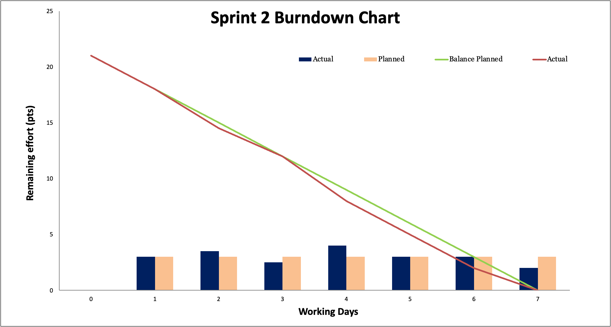

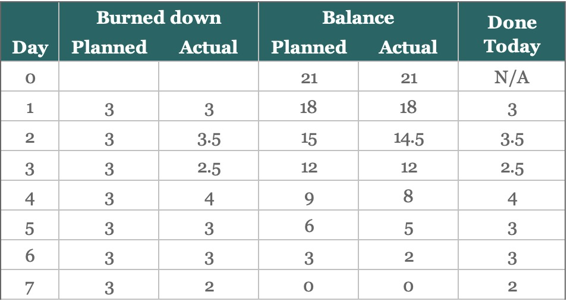

The sprint burndown chart indicates the estimated versus actual working days and its efforts in the graphical represented way. As the burndown chart significantly demonstrates the first four days were relatively intensive (compared to the expected workload). As a result, the trend of work in the first half of the period declined more rapidly.

<div STYLE="page-break-after: always;"></div>

#### 2.3.3 Velocity Chart

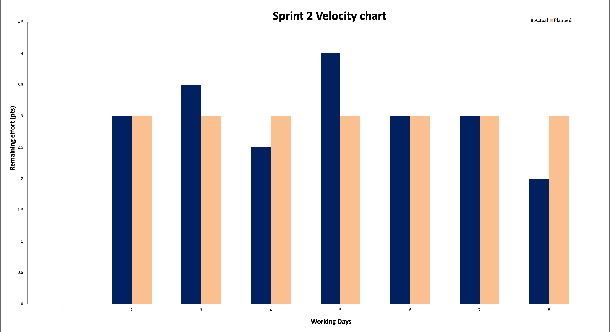

And in the velocity chart, you can clearly see that the actual work is more efficient than the expected completion (the actual workload is less than expected at a later stage). This is a good example of how well a scrum project can be accomplished with effective communication within the group.

<div STYLE="page-break-after: always;"></div>

### 2.4 User Stories, Backlogs and Review

In the Sprint 2, the team successfully implemented a series of user stories designed to enhance functionality within the Virtual Scroll Access System (VSAS).

#### 2.4.1 Scroll Related

>[!QUESTION] User Story
>As a user, I wish to preview the content before I download it, and I can choose whether or not to download it, so that I can download the scroll I want.

>[!TODO] Sprint Backlog
> To achieve user story, these backlogs are created and assigned to developers:
> - Add an attribute to detect the text file in Scroll database.
> - Design a UI that allow users to preview the content in a scroll before they download it.
> - Implement a backend method to return preview information based on different file format in the backend.

>[!CHECK] Acceptance Test and Review
>We implemented functionality that allows users to preview the content of scrolls before deciding whether to download them. User can select `2` in the main page to access the download page (also `5` for previewing the contents only).
>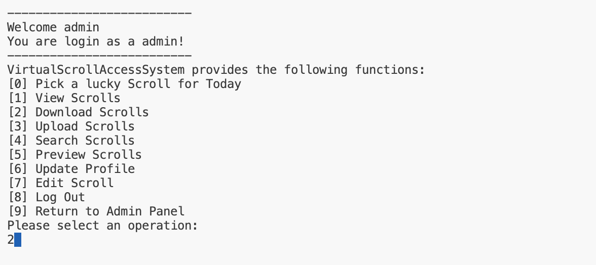
>
>The download page displays a list of scrolls, including information on whether a scroll is readable based on its file type, shown in the `File Type` column. To support this feature, we enhanced the Scroll database by adding an attribute that detects the text file type for each scroll entry. Currently, the system supports `.txt` files as readable formats, allowing users to preview these files. This functionality can be expanded to include more file types in future iterations.
>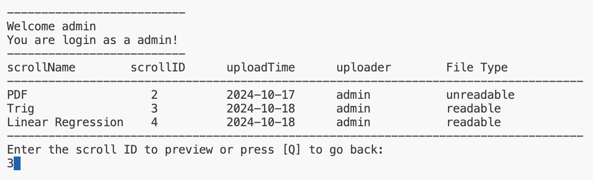
>
>When a user selects a scroll with a readable format (e.g. plain text), the interface displays a preview window showing the first 30 words of the content. This allows users to review the content before deciding whether to download the entire scroll.
>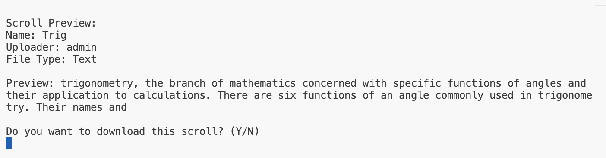
>
>For scrolls with unreadable formats (e.g., PDF), the interface notifies the user that the content cannot be previewed. Nevertheless, users still have the option to download these scrolls if they wish.
>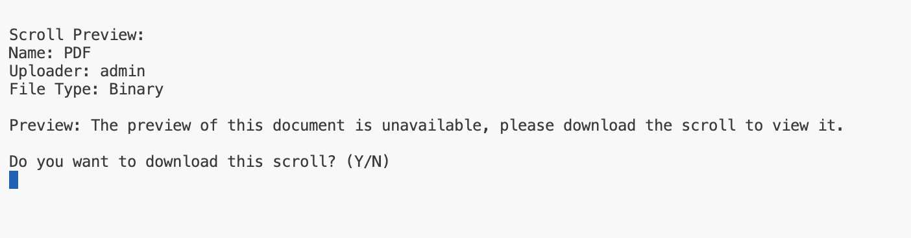
>
>On the backend, we developed a method that processes various file formats and returns the appropriate preview information. If the file type is identified as `1` (readable), the content is extracted and sent to the frontend for display. Otherwise, the backend returns a message indicating that the file type is unsupported for preview.
>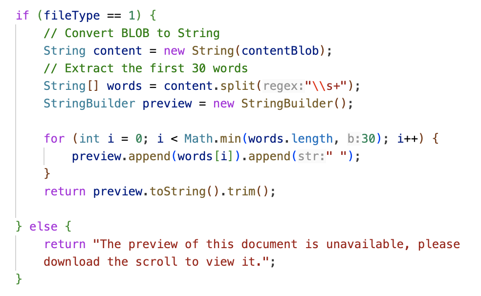
>
>This implementation was thoroughly tested to confirm that users can access the scroll list, view content previews for supported file types, and choose to download scrolls based on the available information. The backend successfully detects and processes different file types, ensuring accurate and reliable content previews.

<div STYLE="page-break-after: always;"></div>

>[!QUESTION] User Story
>As a user, I want to view all available scrolls based on specific search keywords so I can find the scroll I want easily.

>[!TODO] Sprint Backlog
> To achieve user story, these backlogs are created and assigned to developers:
> - Implement a filtering or searching functionality in the main UI for user to view all intended scrolls.
> - Allow optional query parameters for filtering and sorting scroll information based on user input.
> - Implement a filtering or searching functionality in the main UI for user to view all intended scrolls.
> - Create a backend method to retrieve scrolls that satisfy a specific filtering requirement from the Scroll database.

>[!CHECK] Acceptance Test and Review
>We implemented a search functionality that allows users to search for scrolls based on provided keywords. Users can access the search menu by selecting option `4` from the main page.
>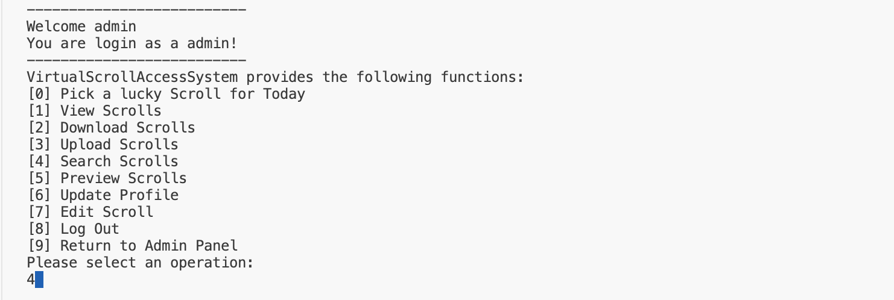
>
>The search menu offers three different criteria for users to filter scrolls:
>
>- **Scroll ID:** Users can search by entering a specific scroll ID.
>- **Uploader:** Users can filter scrolls based on the uploader’s name.
>- **Time Range:** Users can specify a date range to find scrolls uploaded within that period.
>
>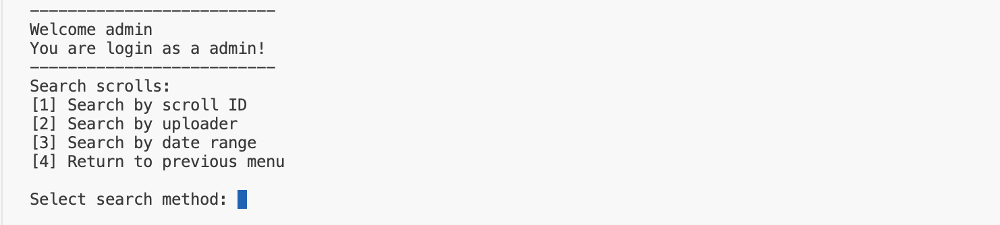
>
>If the user searches using the scroll ID, all scrolls matching the entered ID will be displayed. In the example below, `2`was entered, and the scroll with that ID is returned successfully.
>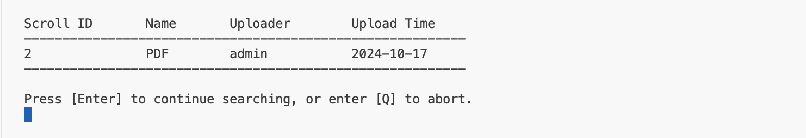
>
>Users can also search based on the uploader's id. In this example, "admin" is entered as the search term, and all scrolls uploaded by "admin" are displayed.
>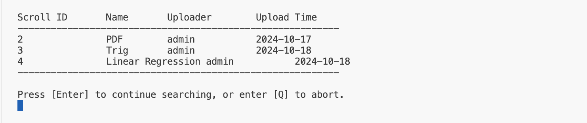
>
>The user can search for scrolls uploaded within a specific date range. For instance, searching between `2024-10-15` and `2024-10-17` returns all scrolls uploaded during that period.
>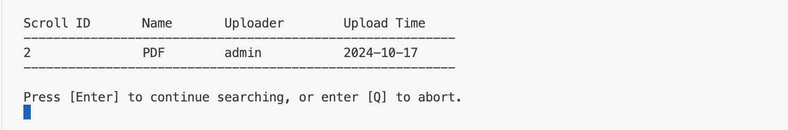
>
>If no scrolls match the specified criteria, the system notifies the user. For example, searching from `2024-01-01` to `2024-01-02` yields no results, as shown below.
>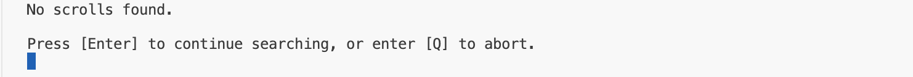
>
>The system includes error handling for invalid input. For example, if a user enters a date range where the end date is before the start date, an error message is displayed, prompting the user to correct the input.
>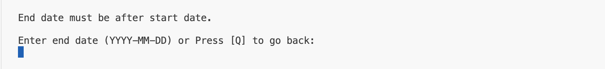
>
>This comprehensive search functionality ensures that users can effectively locate scrolls using various filters, enhancing the efficiency of the application. The backend successfully processes and validates user inputs, providing accurate results or appropriate error messages as needed.

<div STYLE="page-break-after: always;"></div>

#### 2.4.2 Admin Related

>[!QUESTION] User Story
>As an admin, I want to view the number of downloads/uploads in each scroll so I can manage the scrolls status.

>[!TODO] Sprint Backlog
> To achieve user story, these backlogs are created and assigned to developers:
> - Add attributes upload/download counters for each time relevant methods called into Scroll.
> - Create a backend method to extract the statistics of a scroll.
> - Create a backend method to update upload/download counter by given scroll_id.
> - Design an upload/download counter view for admin user.

>[!CHECK] Acceptance Test and Review
>We developed a feature in the admin panel that allows administrators to view scroll statistics. Admins can access the statistics page by selecting option `4` from the admin menu.
>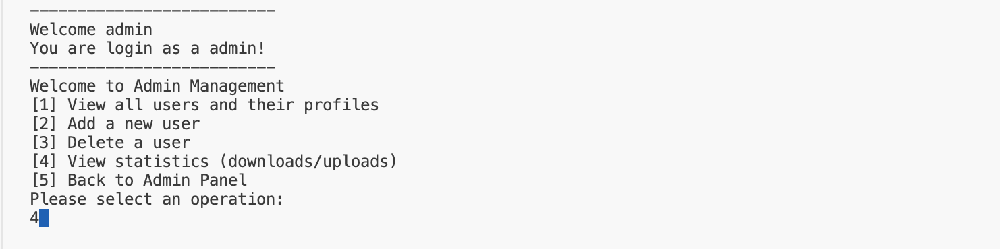
>
>The statistics page provides an overview of all scrolls in the system, along with their respective download and upload counters. This information helps admins monitor the usage and activity of each scroll.
>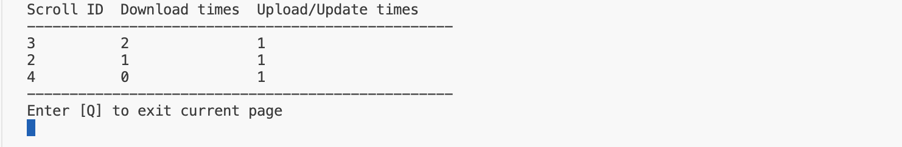
>
>The download counter increments each time a scroll is downloaded. This is handled by the `updateDownloadCounter`method, which updates the count in real-time whenever a download action is performed. The screenshot below shows the download counter for a scroll.
>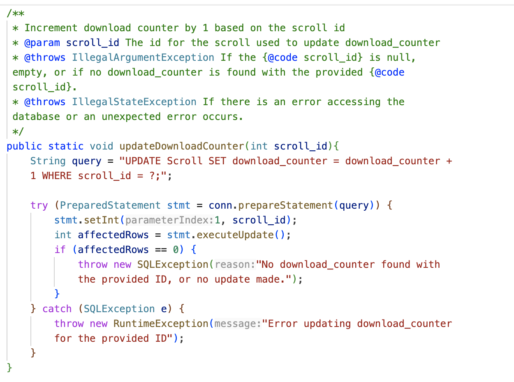
>
>Similarly, the upload counter is updated whenever a scroll is uploaded or edited successfully. This ensures that the upload activity for each scroll is accurately tracked, giving admins a clear view of the number of uploads associated with each scroll.
>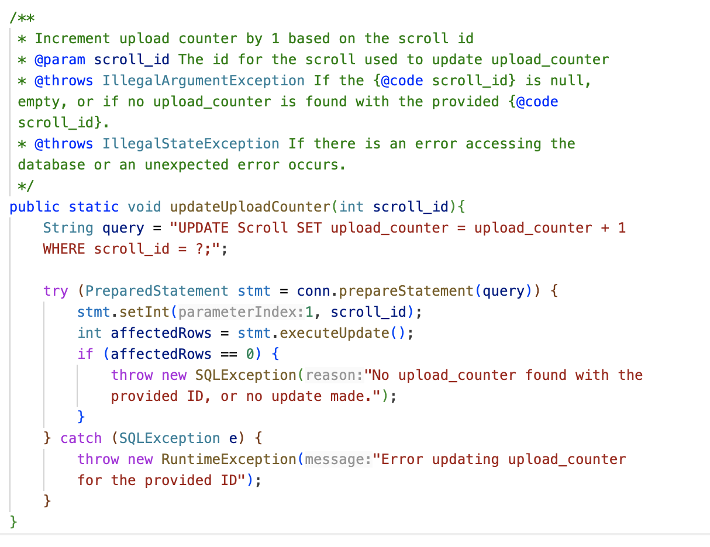
>
>This implementation allows admins to efficiently monitor scroll activities, providing valuable insights into the system's usage patterns. The counters update in real-time, ensuring the statistics displayed are accurate and up-to-date.

<div STYLE="page-break-after: always;"></div>

#### 2.4.3 New Feature

>[!QUESTION] User Story
>As a user, I want to view a random text scroll so I can see contents of the same scroll logged in on the same date.

>[!TODO] Sprint Backlog
> To achieve user story, these backlogs are created and assigned to developers:
> - Add an attribute to detect the text file in Scroll database.
> - Create a backend method to add a new daily scroll into the Daily_Scroll database.
> - Create a daily random scroll UI and display its content.
> - Create a new database to store everyday random scroll info.

>[!CHECK] Acceptance Test and Review
>A new feature called "Get a Lucky Scroll of the Day" was developed, allowing users to view a randomly selected scroll each day. This feature is accessible by selecting option `0` from the main menu.
>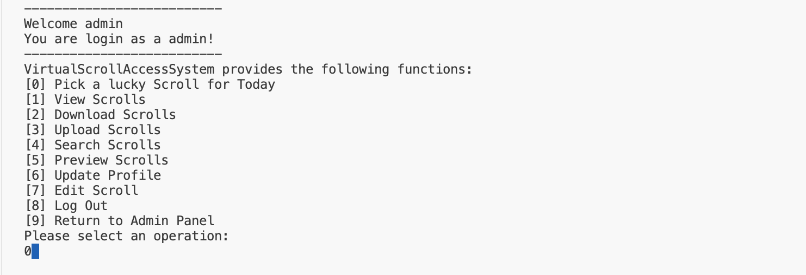
>
>When the user selects this option, the application displays the lucky scroll for the day. The scroll is chosen randomly from the database, and it remains the same for the entire day. In the example below, today's lucky scroll is "Linear Regression."
>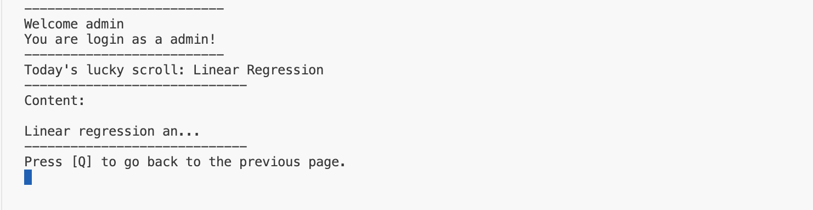
>
>Only readable scrolls (e.g. plain text files) are eligible to be selected as the lucky scroll. If the database contains no readable scrolls, the application displays an error message indicating that no valid text scroll is available.
>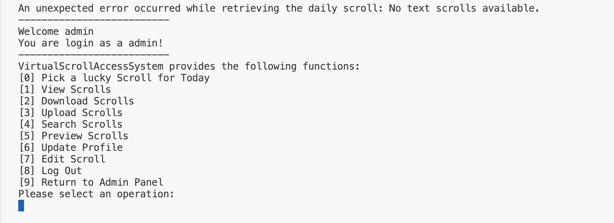
>
>The lucky scroll is refreshed each day. A new lucky scroll will be selected.
>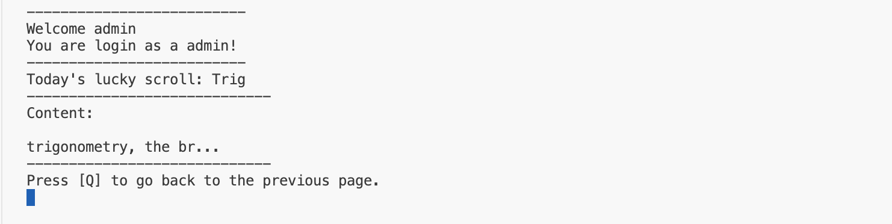
>
>This feature adds an element of surprise and engagement for users by offering a new scroll each day, while ensuring that only appropriate (readable) scrolls are selected. The application handles the selection logic effectively, providing informative feedback when no valid scrolls are available.

<div STYLE="page-break-after: always;"></div>

## 3 Agile Tools

Agile tools are essential for streamlining and automating various aspects of the development process, ensuring efficiency, collaboration, and quality. In this project, we utilise agile tools to manage code, automate builds, and run tests, supporting continuous integration and delivery (CI/CD).

### 3.1 Code Management: GitHub

>[!CITE] Reference
>Please refer to Sprint 1 report (section 3.1) to see the basic GitHub usage.

In this project, we use GitHub as our primary tool for code management. The GitHub repository serves to store the code and maintain the revision history of each file, allowing anyone with the necessary permissions to make modifications and fixes.


<div STYLE="page-break-after: always;"></div>

#### 3.1.1 Github Contribution

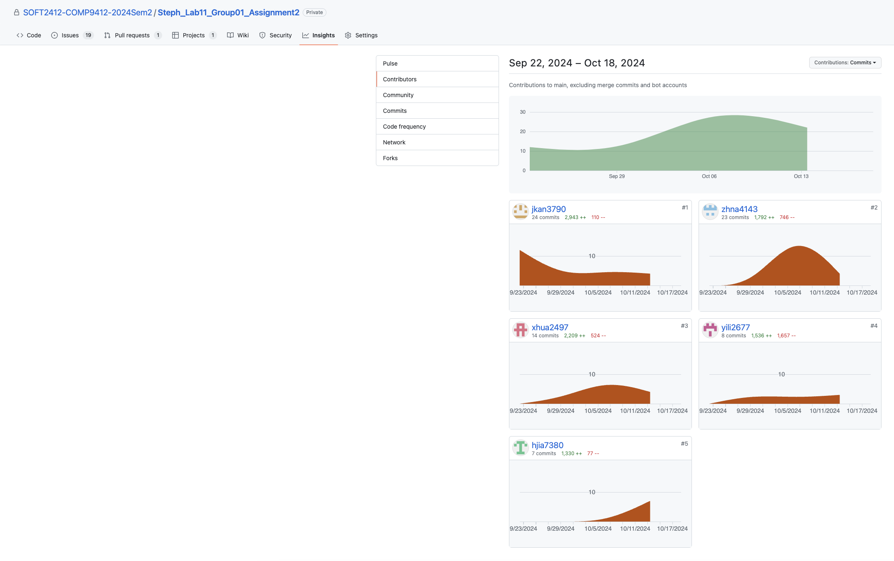

This figure obviously generates the Github contribution ordered by the commits for five developers. It demonstrates that every developer starting from sprint 0 up to current (the ending of sprint 2) all contributes into this repository (`SOFT2412-COMP9412-2024Sem2/Steph_Lab11_Group01_Assignment2`). However, considering the issues happened on `2.2.5`, the current recorded contribution is quite confusion.

<div STYLE="page-break-after: always;"></div>

#### 3.1.2 GitHub Setup and Git Commands

##### 3.1.2.1 Repository Setup

- **Repository Creation**: The GitHub repository created by the team is utilised for centralised version control and collaboration. As the image generated, this repository is named `Steph_Lab11_Group01_Assignment2` and is hosted at `SOFT2412-COMP9412-2024Sem2` (strictly adhere to formatting criteria). 

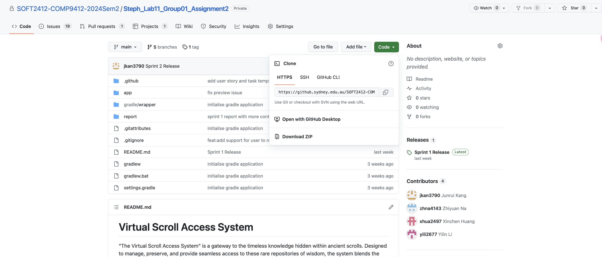

- **Branch Strategy**: The repository has to follow a GitHub branching strategy to ensure smooth collaboration. And the team uses:
  - `main` branch: for summarising each sprint ending works (e.g., commit `Sprint 2 release` into `main` done by `jkan3790`)
    
  - `dev` branch: for most finished working as each developer finished their `In progress` tasks
  - `feature-x` branch: a sub-branch on `dev`. For every developer's ongoing integration working
  - `report` branch: for sprint report editing
  
Based on this strategy, the team must act in accordance with and clear division of labor and cooperation. But as the image shown, there were still some unclear branch exists (working for next sprint). This should be mentioned on next sprint to figure out.

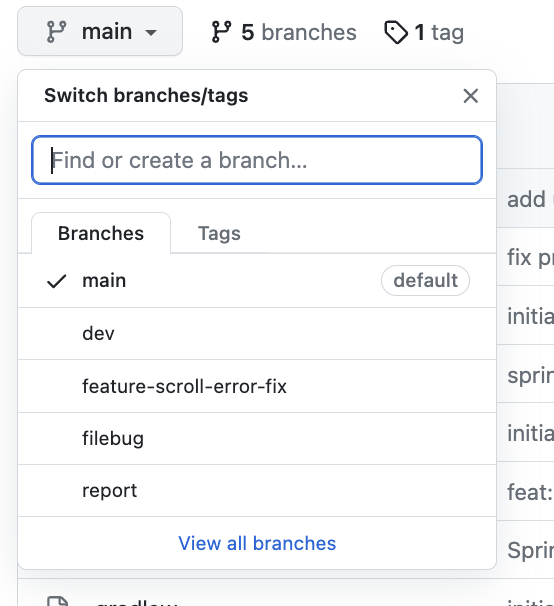

- **Access Control**: The team allocated the repository with appropriate access control, avoiding most covered  issues happens on the branch merged. As the given figure develops an example for the pull request for `feature-x` branch merging into `dev` branch. Under the reviewers section, the pull request is set `at least 1 approving review is required to merge this pull request`. This enhances the correctness on working and makes the repository more clearly. And all the irregular requests (modify on other developer workspace, error branch, ambiguous work, etc.) will be rejected by reviewers.

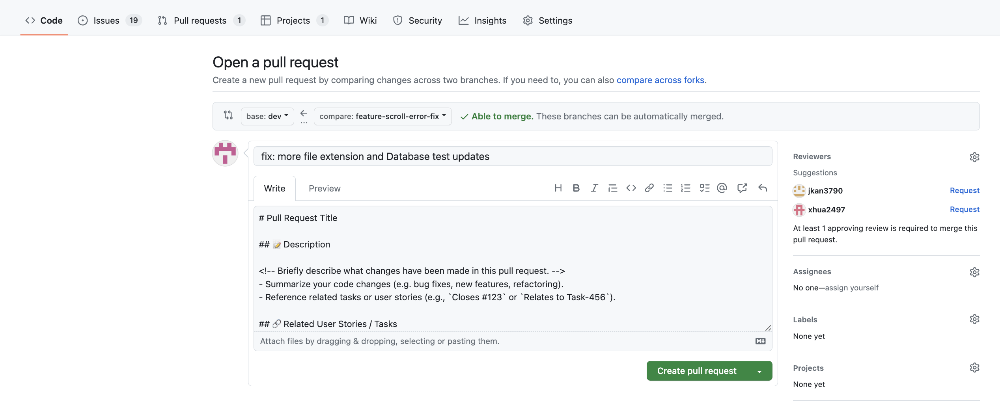

Here is an ambiguous work pull request was rejected by `jkan3790`. As viewing the file changed on this pull request, the developer `zhna4143` only added the extra whitespaces on `Interface.java`. The useless work cannot be approved where this is not an available work to merge into the `dev` contribution. Therefore, it should be rejected.


<div STYLE="page-break-after: always;"></div>

##### 3.1.2.2 Git commands

There are a few main git commands used to modify, create and pull actions in a GitHub repository. Here are the main roles employed in this project for each command:

- `git add` – move changes from the working directory to the staging area.
  
This is an example when the developer wants to add the number of images and modified report updates onto the remote repository.

- `git commit` – save staged changes to local repository and creates a new entry in the commit history.
  
  This is an example when the developer writes the commit with an addition updates on the report 2.3 section. And the changes are moved into the staged status which is ready to upload on the remote GitHub repository. 

- `git push` – update local commits (or branches) into remote repository. 

 This is an example when the developer push the commit for the previous report edition. After the command executed, the inserted objects size and items should be automatically calculated and update on the remote GitHub repository `report`.

- `git pull` – bring the local branch up to date with the remote branch by fetching new (similar to `git fetch`). 

- `git checkout` – switch between branches or checkout specific commits. 

This is an example when the developer wants to switch from current branch into `dev` branches. `A` stands for "Added" and means that the files have been staged for the next commit.

- `git rebase` – reapply commits from the current branch onto another branch. 
- `git merge` – combine changes from one branch to another. 
- `git status` – display the current state about uncommitted/untracked changes, and the staging status of files.

  This is an example when the developer checks out in the current state that all untracked modifications and changes compared with the remote repository.

- `git stash` - temporarily saves the local modifications (changes in tracked files, staged files, or both) without committing them to allow the branch switching or pull updates.

  This is an example when the developer temporarily saves changes and may want to switch branches or pull updates. `WIP on report` stands for "Work In Progress", and references to the most recent commit before stashing (which is the commit with message `add: 2.3 insert`) .

<div STYLE="page-break-after: always;"></div>

#### 3.1.3 Git Issues

Using GitHub Issues in group repositories can help improve team collaboration, organisation, and communication. It makes the team project's concerns apparent, allowing members to rapidly comprehend the problem and provide appropriate remedies, eliminating a lot of unnecessary trouble (such as duplicity). The following part discusses in detail the challenges encountered by team members while compiling code:

1. Need a db table to statistic the download/upload/update counts
   
  This problem is related to the user story on admin interface has available viewing scroll statistics. As the `Database.java` missed the SQLite method to return those values, a methodology is implemented by `xhua2497` and assigned to `yili2677` for checking validation:

  ```
public static ArrayList<HashMap<String, Object>> getScrollStatistics() {
    ArrayList<HashMap<String, Object>> statistics = new ArrayList<>();
    String query = "SELECT scroll_id, download_counter, upload_counter FROM Scroll ORDER BY download_counter DESC;";

    try {
        PreparedStatement stmt = conn.prepareStatement(query);
        ResultSet rs = stmt.executeQuery();

        while (rs.next()) {
            HashMap<String, Object> stat = new HashMap<>();
            stat.put("scroll_id", rs.getInt("scroll_id"));
            stat.put("download_counter", rs.getInt("download_counter"));
            stat.put("upload_counter", rs.getInt("upload_counter"));

            statistics.add(stat);
        }
        rs.close();
        stmt.close();
    } catch (SQLException e) {
        throw new IllegalStateException("Database access error occurred.", e);
    }
    return statistics;
}

temporary code for Using
```
  Fixed: The method is proved by `yili2677` and added into Database.java.

  

2. Need a function to search the scroll by name and timestamp
   
  This problem is related to the user story that when user wants to view all available scrolls with given information. 

  Fixed: Implement getScrollInfoByName() and searchScrollByTimeRange() methods in database to solve this issue.


<div STYLE="page-break-after: always;"></div>

#### 3.1.4 GitHub Network Graph

The team contribution timeline can be intelligibly represented by the Network Graph on GitHub repository in the visual way. This allows the developers to see the history of development, like when the branches diverged and merged, allows to track the repository evolution. Here is the branch starting diverged by each developer:

- `jkan3790`:

- `xhua2497`:

- `yili2677`:

- `zhna4143`:

- `hjia7380`:


These clearly demonstrate the first starting branch on sprint 2 for each developer. Considering the merged pull request is done by other reviewers and is hard to recognise. Then it would not identify in this section.

<div STYLE="page-break-after: always;"></div>

#### 3.1.5 Pull Requests

The pull request permits developers to propose changes to the `dev` repository and increments their contribution to the project editing. As the previous mentioned, the scrum master provided a formal pull request format for developers to employ. And the list of pull requests for sprint are illustrated below (only shown the approved correct requests in here):

1. `dev`<-`feature-scroll-frist-enhancement` edited by `yili2677` (approved by `jkan3790`)

<div STYLE="page-break-after: always;"></div>
2. `dev`<-`feature-preview` edited by `jkan3790` (approved by `xhua2497`)

<div STYLE="page-break-after: always;"></div>
3. `dev`<-`feature-roll-random-roll` edited by `xhua2497` (approved by `yili2677`)

<div STYLE="page-break-after: always;"></div>
4. `dev`<-`newTwo` edited by `xhua2497` (approved by `yili2677`)

<div STYLE="page-break-after: always;"></div>
5. `dev`<-`revert-99-Ruser` edited by `yili2677` (approved by `xhua2497`) revert pull request for `hjia7380` branch

<div STYLE="page-break-after: always;"></div>
6. `dev`<-`bug-fix` edited by `xhua2497` (approved by `yili2677`)

<div STYLE="page-break-after: always;"></div>
7. `dev`<-`feature-scroll-searching` edited by `yili2677` (approved by `jkan3790` and `xhua2497`)

<div STYLE="page-break-after: always;"></div>
8. `dev`<-`fix-database` edited by `jkan3790` (approved by `yili2677`)

<div STYLE="page-break-after: always;"></div>
9. `dev`<-`Nuser` edited by `hjia7380` (approved by `jkan3790`)

<div STYLE="page-break-after: always;"></div>
10. `dev`<-`scroll` edited by `zhna4143` (approved by `jkan3790`)

<div STYLE="page-break-after: always;"></div>
11. `dev`<-`bug-fix-dailyscroll` edited by `jkan3790` (approved by `xhua2497`)

<div STYLE="page-break-after: always;"></div>

And the final coding project `dev` merged into `main` branch to summarise the sprint 2 work:
12. `main`<-`dev` edited by `jkan3790` (approved by `xhua2497` and `yili2677`)


<div STYLE="page-break-after: always;"></div>

#### 3.1.6 GitHub Release and Tags

GitHub release and tagging is used to manage and mark the release version of each sprint. By tagging these versions, the team provides the client with a clear way to visualise and track changes between sprints.

We create a new release on Wednesday night (the day before the sprint review meeting with the stakeholder) in the GitHub release page and tag it with the corresponding sprint number.


The release will contain summary of what we did in this sprint as a reference to our stakeholder.


<div STYLE="page-break-after: always;"></div>

### 3.2 CI/CD: Gradle

Gradle served as the build automation tool for this project, managing dependencies, compiling code, running tests, and generating results.

#### 3.2.1 Gradle Build File

>[!CITE] Reference
>Please refer to Sprint 1 report (section 3.2) to see details about the gradle build file used in this project. The following part remains the same as Sprint 1.

- **Plugins**:
	- `application` plugin: This plugin supports building and running Java applications directly from the command line. It simplifies the packaging process by specifying the main class (`VirtualScrollAccessSystem.App`), allowing for the easy creation of runnable applications and automating tasks such as executing the main class.
	- `jacoco` plugin: This plugin integrates JaCoCo, a code coverage tool that measures the coverage of JUnit tests. It generates coverage reports, helping ensure that the application code is thoroughly tested.


- **Repositories**:
	- `mavenCentral()`: Gradle pulls all required dependencies from the Maven Central repository, facilitating the download and management of external libraries.


<div STYLE="page-break-after: always;"></div>

- **Dependencies**:
	- `testImplementation 'org.junit.jupiter:junit-jupiter:5.8.1'`: Adds JUnit Jupiter (JUnit 5) as a dependency for unit testing. JUnit Jupiter provides a structured framework for writing and executing tests.
	- `implementation 'com.google.guava:guava:30.1.1-jre'`: Integrates Google Guava, a library offering utilities for collections, caching, and string manipulation, making it easier to handle complex data structures and utility functions within the application.
	- `implementation 'org.xerial:sqlite-jdbc:3.46.1.3'`: Adds support for using SQLite as a database through the SQLite JDBC driver.
	- `implementation 'org.mindrot:jbcrypt:0.4'`: Incorporates the BCrypt library for password hashing, enhancing the security of user credentials.


- **Application Configuration**:
	- `application.mainClass = 'VirtualScrollAccessSystem.App'`: Defines the main entry point as the `App` class within the `VirtualScrollAccessSystem` package, simplifying the execution of the application using Gradle.


- **Testing**:
	- `test (JUnit test)` task: The test task utilises the JUnit platform (`useJUnitPlatform()`) for running unit tests with JUnit 5. Automated testing offers detailed feedback on test outcomes, ensuring the application behaves as expected.
	- `junitXml.required.set(true)` and `html.required.set(true)`: These configurations ensure that XML and HTML reports are generated for test results. The XML report is suitable for CI platforms like Jenkins, while the HTML report is convenient for developers to view in a browser.


- **Code Coverage**:
	- `jacoco` and `jacocoTestReport`: The `jacoco` task utilises JaCoCo for measuring code coverage, while the `jacocoTestReport` task generates reports in XML and HTML formats. This helps track the percentage of code covered by tests, highlighting areas that need further testing.


- **Custom Tasks**:
	- `run { standardInput = System.in }`: Configures the application to accept user input from the command line during execution, enabling real-time interaction with users.


<div STYLE="page-break-after: always;"></div>

#### 3.2.2 Gradle Commands

The main Gradle commands utilised were `gradle init`, `gradle build`, `gradle run`, `gradle run --console=plain`, and `gradle test`.

- **`gradle init`**: This command initialises the Gradle project, creating the necessary directory structure, configuration files (`build.gradle`), and other essential files for the project setup. It serves as the first step to prepare the environment for development.
- **`gradle build`**: This command compiles the source code and builds the project into a JAR file. It also verifies that all dependencies are available and that there are no compilation errors. Running `gradle build` ensures that the application is properly assembled and packaged before further steps are taken. The command was executed as the second step after `gradle init` and coding part to validate that the code was stable and ready for testing.
- **`gradle test`**: Following the build, `gradle test` was executed to run all unit and integration tests defined in the project. This step is essential for verifying that the code functions as expected and meets the quality and functional requirements. This command was run immediately after `gradle build` to catch any issues in the code before moving to execution.
- **`gradle run`**: After the code passed all tests, the application was executed using the `gradle run`command. This command starts the application by running the main class specified in the `build.gradle` file. It allows for validating that the build works as expected when deployed and executed in the local environment.

<div STYLE="page-break-after: always;"></div>

The sequence of running these commands typically followed this order:
1. **`gradle init`** command sets up the project environment (done in the Sprint 0).
2. **`gradle build`** command compiles the application.
	
	As shown in the provided screenshot, the build for the Sprint 2 release code was successful, indicating that all code compiled correctly. Normally, `gradle build` command will run all unit tests found in the test directory, in this case, for demonstration, `gradle build -x test` is used to skip the testing step.
3. **`gradle test`** command runs tests.
	
	
	The command outputs the results of the tests, indicating which tests passed and which failed. All tests pass in this screenshot.
4. **`gradle run`** command executes the application.
	
	This command executes the application. It runs the main class defined in the project configuration, which is `App` in this project. The VSAS application will be executed then. 

<div STYLE="page-break-after: always;"></div>

#### 3.2.3 Gradle Builded JAR File

After executing the `gradle build` command, a JAR (Java Archive) file is generated as part of the build process.

This file is a packaged representation of the compiled application, containing all the necessary classes, resources, and metadata required for execution. All Java class files created from the source code are included, allowing the application to run without needing to recompile in the client's devices.


The builded JAR file can be executed using `java -jar <jar_file.jar>` command.


This confirms that the JAR is functioning as intended after being built and packaged by Gradle.

<div STYLE="page-break-after: always;"></div>

### 3.3 CI/CD: Jenkins

>[!CITE] Reference
>Please refer to Sprint 1 report (section 3.3) to see the Jenkins usage.

The Jenkins configuration in this program is developed following Edstem's tutorial, enabling web-hook communication between the local Jenkins instance and the GitHub repository using `ngrok http 8080`. Once connected, Jenkins automatically triggers builds and runs automated tests whenever code is contributed to the shared GitHub repository.

#### 3.3.1 Jenkins Integrated With GitHub

The Jenkins and GitHub Integration is built through the GitHub WebHooks. As the time when the `ngrok http 8080` is executing on the developer own PC, then the `Payload URL` should be generated on the terminal. As the time the integration is hooked, the developer should ensure that `ngrok http 8080` is always executing in the backend on the developer's PC. Otherwise, the link would be terminated and the Jenkins Project cannot be hooked as the previous `Payload URL`, where the `ngrok http 8080` is automatically changing as each time opening. As well as this hook has been employed at the beginning of the scrum project (Sprint 0), therefore the data is unable to lose dynamically.


The following displays the how to receive changes once the developer `jkan3790` successfully pushed the summary of the sprint 2 work to a GitHub repository. When Jenkins receives a message from the GitHub webhook, it utilises git to fetch the most recent commit from the repository (SEND TRIGGER TO JENKINS FROM GitHub) and checks the source code using a sequence of tasks.

The console output indicates that Jenkins connected to the repository and downloaded the most recent updates. The job runs smoothly and without mishap. This means that the code was successfully retrieved from GitHub, built, and is available for further processing.

Gradle (`gradle_build`) is also set up for usage with Jenkins, ensuring that Jenkins automatically downloads and install the required Gradle version. This step enables Jenkins to automate the execution of Gradle test tasks for all unit and integration tests defined in the project.


<div STYLE="page-break-after: always;"></div>

##### 3.3.2 Jenkins Build and Test Coverage

**Jenkins Build**

The continuous integration (CI) plugins built on the Jenkins facilitate the development and reduce the rate of complexity existing in the team work. Where the Jenkins employed in this project is utilised a freestyle project, which is the central feature of Jenkins extremely suitable for the software design.


During the connection between Jenkins and GitHub, the repository should be noticed that using the `HTTPS` as the figure shown (`https://github.sydney.edu.au/SOFT2412-COMP9412-2024Sem2/Steph_Lab11_Group01_Assignment2.git` for current sprint 2 using), and then connected with the developer's Global credentials (username and password working with the GitHub repository) and API with the `usyd GitHub`. In here, the developer `yili2677` is the Jenkins manager for this whole scrum project.


Excepted the normal plugins for the general software design using (Gits and Gradle), there are several extra plugins have been applied in this scrum project (as well as sprint 2):

**Publish JUnit test result report: this plugin** 

The JUnit test result report is automatically generated with every `git push` to the `main` branch, taking advantage of the CI's ability to automate and consolidate changes, as opposed to the usual cumbersome `gradle test` (which only generates a report with the run command and requires a lookup in the file to see it). Jenkins visualization of trends can easily help teams quickly browse the information. This can play a big advantage in meeting.png)

Comparing to the sprint 1, the code coverage trend and test result trend both decreased. This is caused by the issue demonstrated on the contribution confusion (linked to 2.2.5) and partial of the testcases in `Database.java` not included in this push. This issue will be fixed on the next sprint.


**Record JaCoCo coverage report**

Similarly, this plugin also handles the role of CI ability and automatically generates a JaCoCo report on Jenkins dashboard. This saves a lot of times for searching the file directory and looking up. As the below generated, the sprint 2 test coverage with `INSTRUCTION = 50%` and `BRANCH = 25%`. This has a large range not covered tested as the client limitation (both coverage at least 75%). Thus, on sprint 3 should focus on the testcase writing.


**Archive the Artefacts**

Jenkins generates the 'app.jars' plugin with each code push, which includes the libraries required for the plugin's functionality. It includes reusable code components that the Jenkins plugin can use without rewriting. This also allows the developer to download and run the file in their own terminal without having to use code.


<div STYLE="page-break-after: always;"></div>

##### 3.3.3 CI Jar Running In Terminal

As the `app.jar` automatically generated by Jenkins after pushing code, this file can be able to execute with the appropriate command after downloading into local PC. Here is the steps for the sprint 2 `app.jar` running:

1. Firstly, the `app.jar` file generated by Jenkins for the last successful artifacts (`Sprint 2 release` commit pushed [link to 3.1.5]) should be downloaded into the local directory. As the developer testing shown, this file has been downloaded into `Downloads` folder.


2. Then, the developer turns on the terminal and moves the current directory to `Downloads` then execute the command:
```agsl
jar tf app.jar
```
This is used to list all the contents in this downloaded file. As the terminal shown, the main class file `VirtualScrollAccessSystem/` is located in this jar file, which means it is able to run without any origin code based.


3. Finally, the jar running command directly:
```agsl
java -cp app.jar VirtualScrollAccessSystem.App
```
If the `App.class` in the original Java code folder contains a `main` method, this command should kick the action as the below showing, which currently runs the project as same as sprint 2 uploaded code.


<div STYLE="page-break-after: always;"></div>

### 3.4 Testing: JUnit and Jacoco

#### 3.4.1 Overall Test Coverage


As part of our ongoing efforts to ensure code quality and reliability, we have evaluated the test coverage for the project. Currently, the overall test coverage is as follows:

- **Instruction Coverage**: 31%
- **Branch Coverage**: 23%

Instruction Coverage measures the percentage of executable lines of code that have been tested. A coverage of 31% indicates that a little less than one-third of the code has been executed during testing, suggesting that there are many untested paths in the codebase.

Branch Coverage examines the percentage of decision points (like `if` statements) that have been tested. With a branch coverage of 23%, this implies that only a small fraction of the conditional paths in the code have been exercised.

The current code coverage metrics indicate that our project's coverage is low. Several factors have contributed to this situation:

1. **Time Pressure**: The development timeline for the project has been compressed, leading to constraints on how thoroughly we could test the code.
2. **Reliance on Manual Testing**: Instead of implementing formal test cases, the team primarily conducted manual testing for frontend functionalities.

The breakdown of testing coverage for different classes are shown in the screenshot below.


<div STYLE="page-break-after: always;"></div>

#### 3.4.2 Database Tests

>[!NOTE]
>These tests are written by Yilin Li (yili2677) and Junrui Kang (jkan3790)


Currently, the test coverage for `Database` class is as follows:

- **Instruction Coverage**: 48%
- **Branch Coverage**: 47%

During the development process of Sprint 2, we encountered significant challenges related to version control that resulted in the accidental loss of tests. Specifically, when a team member's branch was merged into the main branch, the reversion of certain commits inadvertently erased the test cases that had been developed. These tests will be recovered in the next sprint aiming for a higher test coverage.

However, for the already existing tests, we have done the following tests (in general):

- **When inserting and updating a data entry:**
    - **Positive Test Cases:**
        - Normal insertion or update with all required parameters. This test ensures that the data is correctly inserted or updated when all required fields are provided.
    - **Negative Test Cases:**
        - **Primary Key/Unique Constraint Violation:**
            - If the database enforces a primary key (or unique) constraint (e.g., `userid`), a test case should be designed where a duplicate entry is attempted, such as inserting a user with an existing `userid`. This validates the system's response to violations of uniqueness constraints.
        - **Missing Parameters:**
            - If the method requires multiple parameters, test the method by providing fewer parameters than required to verify if the system correctly identifies and handles missing input. For instance, inserting a user without the required email field.

- **When deleting a data entry:**
    - **Positive Test Cases:**
        - Normal deletion with a valid primary key. This ensures that the entry is successfully deleted when the correct identifier is provided.
    - **Negative Test Cases:**
        - **Invalid Primary Key:**
            - Attempt to delete an entry using a non-existent primary key to check if the system gracefully handles cases where the specified identifier does not match any record in the database.
        - **Empty or Null Identifier:**
            - Test deletion with an empty or `null` identifier to see if the system correctly identifies the invalid input and prevents the operation.

The following are all tests for `Database` class:


<div STYLE="page-break-after: always;"></div>

#### 3.4.3 Registered User Tests

>[!NOTE]
>These tests are written by Huiying Jiao (hjia7380)


Currently, the test coverage for `RegisteredUser` class is as follows:

- **Instruction Coverage**: 85%
- **Branch Coverage**: 84%

In these testcases, the test script simulates the user input, and compare the output from the program with the expected output.

**Registration Tests** include a positive test for successful registration when all fields are filled out correctly and several negative tests that assess user exits at various stages of the registration process, the handling of an invalid email format (not in `__@__.__`), and the ability to exit at different input fields.

**Check User ID Exists Tests** feature a positive case confirming the detection of an existing user ID, alongside a negative case testing the system's response to a non-existent user ID.

**Display Current User Info Tests** consist of a positive test that verifies the accurate display of user information.

**Update Email, Phone Number, and Full Name Tests** include positive tests to validate successful updates with valid input and negative tests to check the system's responses to illegal arguments during these updates.

**Verify Old Password Tests** assess the successful verification of the old password and its handling of incorrect input.

**Set New Password Tests** include a positive test for successfully setting a new password and a negative test to verify the system's response when the new password matches the old one.

The following are all tests for `RegisteredUser` class:


<div STYLE="page-break-after: always;"></div>

#### 3.4.4 User Profile Tests

>[!NOTE]
>These tests are written by Huiying Jiao (hjia7380)


Currently, the test coverage for `RegisteredUser` class is as follows:

- **Instruction Coverage**: 85%
- **Branch Coverage**: 84%

In these testcases, the test script simulates the user input, and compare the return value from the method with the expected return value.

The tests cover various scenarios for updating user information, including email, phone number, name, and password.

For each update type (email, phone number, and name), there are positive test cases that confirm the update method is called when changes are made, and negative test cases that verify the method is not called if the update is canceled.

For password updates, the tests are more comprehensive, including positive validation of the update process when the correct old password is provided and a new one is set. The negative cases include handling incorrect old passwords, canceling the update before verification, entering invalid new passwords, and canceling the process after a valid old password is entered.

The following are all tests for `UserProfileManager` class:


<div STYLE="page-break-after: always;"></div>

## Appendix

### Meeting Record

| Time       | Duration    | Description                                                                                                                                                                                                                               | Note                                               |
| ---------- | ----------- | ----------------------------------------------------------------------------------------------------------------------------------------------------------------------------------------------------------------------------------------- | -------------------------------------------------- |
| 2024-10-10 | 10:00–10:30 | Sprint 1 Retrospective meeting, discussing what went well, discovered bugs in the sprint 1 release, and plans for tackling the new feature in sprint 2.                                                                                   | No recording as it was a face-to-face meeting.     |
| 2024-10-11 | 20:00–21:00 | Sprint 2 Sprint planning meeting, voting for the story points, and allocating tasks to developers. No recording.                                                                                                                          | No recording as it was a short discord discussion. |
| 2024-10-13 | 20:00–20:30 | Scrum meeting, demonstrating individual progress. Recording: https://uni-sydney.zoom.us/rec/share/uu5DU5E9Ty2GR-53Q1alZ8yEF1NPUO2zE8DMdCqVibQocPSPQsPtvEJ9mMYv35pZ.3YQ_vGRkghYyFBhr Password: 2*V1RstH                                    |                                                    |
| 2024-10-14 | 20:00–21:00 | Scrum meeting, demonstrating individual progress.                                                                                                                                                                                         | No recording as it was a short Discord discussion. |
| 2024-10-15 | 20:00–21:30 | Scrum meeting, demonstrating individual progress and preparing for sprint 2 release. Recording: https://uni-sydney.zoom.us/rec/share/ijL64WFLM1ZRA37TIk5itWYA9-y15iTAKrVXIAL1llsPChNkqtWxqE9mYVVo1qa0.mZuOkUmcvrxnRHt3 Password: Zj*Gich0 |                                                    |
| 2024-10-17 | 09:00–09:30 | Sprint Review meeting with tutor.                                                                                                                                                                                                         | No recording as it was a face-to-face meeting.     |

<div STYLE="page-break-after: always;"></div>

### Burndown Chart Creation

The `burndown.xls` provided on Canvas is used to generate the burndown chart and velocity chart for sprint 2
